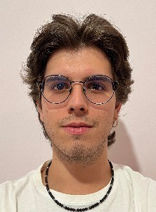

# Cargoservice

Il progetto in questione è il tema finale per l'insegnamento di Ingegneria dei Sistemi Software M 2024/2025.  
Il progetto permette di mettere in pratica gli insegmaneti appresi riguardo:
- metodologia di lavoro agile ed incrementale,
- conoscenze tecniche di sviluppo dei sistemi software.

## Indice

- [Requisiti](#requisiti)
- [Sviluppo Agile ed Incrementale](#sviluppo-agile-ed-incrementale)
- [Team di Lavoro](#team-di-lavoro)

## Requisiti

Il progetto è condotto, nella sua interezza, in lingua italiana, prima lingua di tutti i membri del team di sviluppo.  
Tuttavia, i requisiti sono espressi in inglese, la lingua utilizzata dal committente, e per evitare che la traduzione comporti perdite o alterazioni delle informazioni richieste, si è deciso di non tradurli e di riportarli in inglese: [requirements](requirements).

## Sviluppo Agile ed Incrementale

Abbiamo scelto un approccio incrementale per affrontare la complessità del problema, concentrandoci fin da subito sugli aspetti più rilevanti e critici, senza disperdere l’attenzione in dettagli secondari.  
Questo consente di costruire progressivamente un quadro generale solido e condiviso.

L’approccio agile descritto nella [scrum guide](https://scrumguides.org/) rappresenta il riferimento metodologico adottato.  
Gli sprint eseguono uno zoom progressivo sulle macro-componenti, attivando un processo iterativo di analisi, progettazione, sviluppo e testing del componente o del sottosistema previsto dallo sprint.

- [Sprint 0](sprint0)
- Sprint 1 (previsto ma ancora da mettere in atto)
- Sprint 2 (previsto ma ancora da mettere in atto)
- Sprint 3 (previsto ma ancora da mettere in atto)

## Team di Lavoro

Gli elementi del gruppo sono elencati in ordine alfabetico (cognome).

|  |  |  |
|-----------------------|-----------------------|-----------------------|
| Bertozzi Pietro       | Koltraka Kevin        | La Rocca Andrea       |