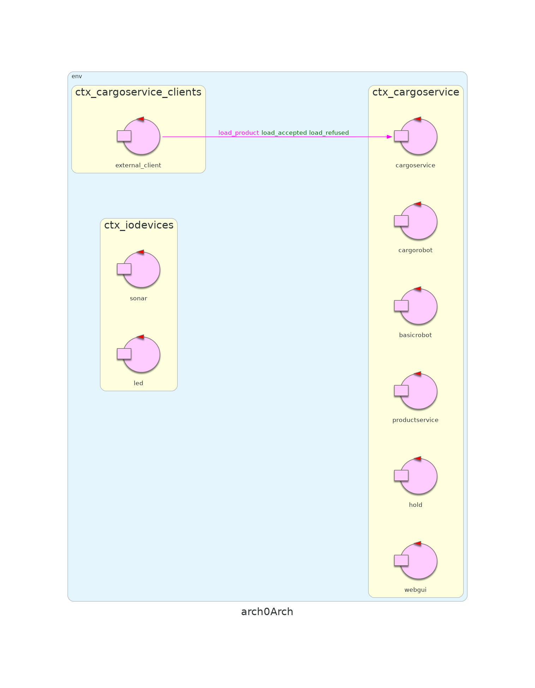
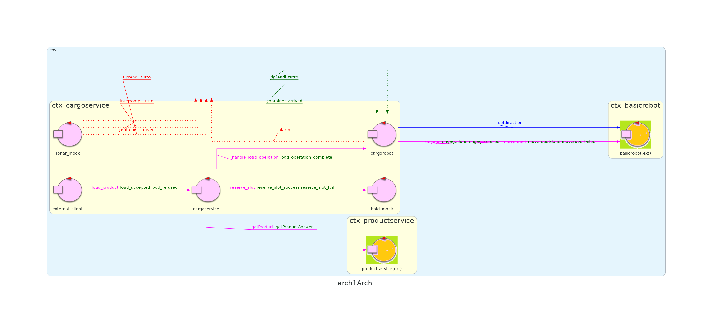

# Sprint 1

## Punto di partenza

L'analisi dei requisiti avvenuta nello [Sprint 0](https://github.com/ingegneria-sistemi-software-m/cargoservice/tree/master/sprint0) ha portato a definire una **prima architettura generale del sistema**.



<div class="page-break"></div>

## Obiettivi

L'obiettivo dello sprint 1 sarà affrontare il sottoinsieme dei requisiti relativi ai componenti cargorservice e cargorobot, effettuandone l'analisi del problema e la progettazione. Particolare importanza verrà data alle **interazioni** che questi componenti dovranno avere con il resto del sistema.

I [requisiti](https://github.com/ingegneria-sistemi-software-m/cargoservice/tree/master/requirements) affrontati nello sprint 1 saranno i seguenti:
- implementare un sistema che è in grado di accettare/rifiutare le richieste di carico
- implementare un sistema in grado di effettuare un intervento di carico nella sua interezza. Questo significa in ordine:
    - andare all'IO-port
    - aspettare il container se non è già presente
    - caricare il container una volta arrivato
    - spostare il cargorobot nella laydown-position corretta
    - scaricare il container nello slot
    - ritornare alla home
- implementare un sistema in grado di interrompere ogni attività in caso di sonar malfunzionante, e in grado di riprendere le attività interrotte una volta risolto il guasto

Va notato che i requisiti affronati in questo sprint presupporrebbere già l'implementazione di altri componenti del sistema come hold e sonar. L'implementazione di questi componenti verrà però affrontata solamente negli sprint successivi. Per questo motivo nello sprint 1 verranno utilizzati dei **componenti mock** che simuleranno il comportamento dei componenti mancanti in **maniera, però, semplicistica**. Ad esempio, hold non causerà mai il rifiuto di una richiesta di carico in quanto non terrà traccia di alcuno stato del deposito.

<!--
## Analisi del problema
Fase di analisi del problema, che termina con la definizione di
- una architettura logica del sistema
- di modelli eseguibili 
- e alcuni significativi piani di testing.

**NB**:  E’ raccomandato che i risultati di questa fase vengano presentati al committente (con opportuno appuntamento) prima della consegna finale del prodotto.
 -->

## Analisi del problema | cargoservice

Come detto nello sprint0, l’attore cargoservice è il componente principale del sistema. Il suo compito è quello di fare da **orchestratore**; in altre parole, deve coordinare le operazioni degli altri componenti del sistema col fine di eseguire le operazioni specificate dai requisiti nel giusto ordine.

La tipica sequenza di attività di cargoservice è la seguente:
1. cargoservice **riceve una richiesta di carico** da parte di un cliente.
    - la richiesta di carico contiene il PID del prodotto da caricare

2. dopo aver ricevuto la richiesta di carico, cargoservice fa una richiesta a productservice per **recuperare il peso del prodotto da caricare** associato al PID ricevuto dal cliente.

3. cargoservice riceva la risposta alla sua query da productservice. Quest'ultima può contenere:
    - un errore in caso il PID inviato dal cliente non sia registrato nel DB. **In questo caso cargoservice può rispondere al cliente con un opportuno messaggio di errore**
    - il peso del prodotto in ogni altro caso

4. dopo aver recuperato il peso del prodotto da caricare, cargoservice  può passare a verificare se lo **stato del deposito permette di soddisfare la richiesta**. Si è definito nello sprint 0 che il mantenimento dello stato del deposito è responsabilità del componente hold; di conseguenza, cargoservice invierà a quest'ultimo un messaggio contenente il peso del prodotto da caricare. Si possono verificare tre casi:
    - richiesta non soddisfacibile in quanto si eccederebbe il peso MaxLoad del deposito. Hold risponde con un opportuno messaggio di errore
    - richiesta non soddisfacibile in quanto manca uno slot libero in cui posizionare il container. Hold risponde con un opportuno messaggio di errore
    - richiesta soddisfacibile. Hold risponde con un messaggio contenente il nome dello slot prenotato dalla richiesta corrente

5. se la richiesta viene accettata, cargoservice può semplicemente richiedere a cargorobot di gestire il container, delegando a lui tutta la logica di attesa, trasporto e deposito del container con una operazione del tipo **handle\load\operation(slot)**. 

6. cargoservice attende il completamento dell'intervento di carico da parte di cargorobot. Nel frattempo, eventuali altre richieste di carico vengono accodate.

7. terminato l'intervento di carico, cargorobot sblocca cargoservice rispondendo alla sua precedente richiesta (evento di sincronizzazione). Da questo punto in poi cargoservice torna a poter servire le richieste di carico.

### Considerazioni

Le attività che cargoservice deve effettuare non pongono particolari problemi da analizzare, si tratta solo di effettuare una serie di richieste. Tuttavia, è stata presa una decisione: quella di **rendere il cargorobot "intelligente"**.

Si sarebbe potuto rendere il cargorobot un mero esecutore di comandi, aggiungendo a cargoservice la responsabilità di dettare la sua posizione e che cosa deve fare in ogni momento. Si è preferito, invece, rendere il cargorobot più intelligente e indipendente per tre motivi principali:   
- l'analisi del dominio effettuata nello sprint 0 ha delineato il cargorobot come un componente con delle mosse più sofisticate
- cargoservice giova di un cargorobot con delle mosse più sofisticate in quanto queste producono un abstraction gap minore 
- principio di singola responsabilità: cargoservice si occupa di fare solo da orchestrare mentre cargorobot si occupa di effettuare le azioni del DDR descritto nei requisiti  

### Nuovi Messaggi

Nello [Sprint 0](https://github.com/ingegneria-sistemi-software-m/cargoservice/tree/master/sprint0/sprint0.pdf) si erano definiti i messaggi con cui interagire con: cargoservice, productservice e basicrobot. L'analisi della sequenza di attività del cargoservice suggerisce i seguenti nuovi messaggi.

**Messaggi per l'interazione con hold**
```
Request reserve_slot         : reserve_slot(WEIGHT)
Reply   reserve_slot_success : reserve_slot_success(SLOT) for reserve_slot
Reply   reserve_slot_fail    : reserve_slot_fail(CAUSA) for reserve_slot
```

**Messaggi per l'interazione con cargorobot**
```
Request handle_load_operation   : handle_load_operation(SLOT)
Reply   load_operation_complete : load_operation_complete(OK) for handle_load_operation
```

### Modello cargoservice

L'analisi della sequenza di attività suggerisce anche gli stati dell'attore QAK con cui modellare cargoservice

```Java
QActor cargoservice context ctx_cargoservice {
	[#
		var Cur_prod_PID = -1
		var Cur_prod_weight = -1
	#] 
	
	State s0 initial{
		println("$name | STARTS") color blue
	} 
	Goto wait_request
	
	
	/* inizio ciclo di servizio */
	
	State wait_request{
		println("$name | waiting for request") color blue
	}
	Transition t0
	   whenRequest load_product -> get_prod_weight


	/* Tento di recuperare il peso del prodotto richiesto */
	
	State get_prod_weight {
		onMsg( load_product : load_product(PID) ) {
			[# Cur_prod_PID = payloadArg(0).toInt() #]
			println("$name | checking with productservice
                     for the weight of PID: $Cur_prod_PID") color blue
			
			request productservice -m getProduct : product($Cur_prod_PID)
		}
	}
	Transition t0
	   whenReply getProductAnswer -> check_prod_answer


	State check_prod_answer {
		onMsg( getProductAnswer : product( JSonString ) ) {
			[# 
				val jsonStr = payloadArg(0)
				Cur_prod_weight = Product.getJsonInt(jsonStr, "weight")
			#]
			
			println("$name | the weight of PID: $Cur_prod_PID") color blue
		}
	}	
	Goto reserve_slot if [# Cur_prod_weight > 0 #] else get_weight_fail

	
	State get_weight_fail {
		[# 
			val Causa = "Non è stato possibile recuperare il peso di 
                         PID: $Cur_prod_PID in quanto non registrato
                         dentro a productservice."
		#]
		println("$name | $Causa") color red
		
		replyTo load_product with load_refused : load_refused($Causa)
	}
    Goto wait_request
	
	
	/* Tento di prenotare uno slot */

	State reserve_slot {
		println("$name | checking with hold if a reservation with 
                 (PID: $Cur_prod_PID, KG: $Cur_prod_weight)
                 is possible") color blue
		
		request hold -m reserve_slot : reserve_slot($Cur_prod_weight)
	}
    Transition t0
	   whenReply reserve_slot_success -> load_cargo
	   whenReply reserve_slot_fail	  -> reserve_slot_fail
    

    State reserve_slot_fail {
		onMsg( reserve_slot_fail : reserve_slot_fail(CAUSA) ) {
			[# 
				val Causa = payloadArg(0) 
				val CausaMsg = "impossibile prenotare uno slot per
                                (PID: $Cur_prod_PID, KG: $Cur_prod_weight).
                                \n\tCausa: $Causa"
			#]
			println("$name | $CausaMsg") color red
			
			replyTo load_product with load_refused : load_refuse($CausaMsg)
		}
	}
    Goto wait_request
	
	/* Richiesta soddisfacibile */

	State load_cargo {
		onMsg( reserve_slot_success : reserve_slot_success(SLOT) ) {
			[# 
				val Reserved_slot = payloadArg(0)
			#]
			// rispondo al cliente
			println("$name | (PID: $Cur_prod_PID, KG: $Cur_prod_weight)
                     is going to be placed in slot: $Reserved_slot")
                     color green
			replyTo load_product with load_accepted : 
                                      load_accepted($Reserved_slot)
			// attivo il cargorobot
			println("$name | waiting for load completion") color blue
			request cargorobot -m handle_load_operation :
                                  handle_load_operation($Reserved_slot)
		}
	}
    Transition t0
	   whenReply load_operation_complete -> load_request_done


	State load_request_done {
		println("$name | product (PID: $Cur_prod_PID, KG: $Cur_prod_weight)
                 successfully loaded!") color green
	}
	Goto wait_request
}
```

## Analisi del problema | cargorobot

Come detto nello sprint 0, e consolidato durante l'analisi di cargoservice,  l’attore cargorobot è il componente responsabile delle attività del DDR all'interno del deposito. cargorobot implementa le sue azioni logiche comunicando con il basicrobot, che a sua volta comunica con l’ambiente virtuale WEnv. Il tutto per effettuare gli interventi di carico richiesti da cargoservice.

Con l'analisi dei requisiti e l'analisi di cargoservice si è già delineata la sequenza di attività del cargorobot:
1. cargorobot riceve da cargoservice una richiesta di gestione di un container contenente il nome dello slot riservato.

2. cargorobot si dirige verso la pickup-position e aspetta che arrivi il container se non è già presente.

3. Una volta che il container è arrivato all'IO-port, cargorobot:
    - recupera il container
    - si posizione nella corretta laydown-position
    - deposita il container nello slot prenotato

4. terminato l'intervento di carico, cargorobot può ritornare alla home rispondendo a cargoservice con un messaggio di successo.

### Considerazioni

- Una volta ricevuta la risposta di successo, **cargoservice torna a essere recettivo** a richieste di carico da parte dei clienti e a poter servire quelle che si sono nel frattempo accodate. 

- Nulla vieta che cargorobot possa incominciare a effettuare immediatamente altri interventi di carico **prima di essere ritornato alla home**. Anzi, sarebbe una soluzione più efficiente.

- Il [requisito numero 5](https://github.com/ingegneria-sistemi-software-m/cargoservice/tree/master/requirements) specifica che **in un qualsiasi momento cargorobot può essere interrotto** fino a quando il sonar non smette di essere difettoso.
    
- Dai requisiti forniti, **non c'è nessun motivo per cui un intervento di carico dovrebbe fallire**. Di conseguenza, l'unica risposta contemplata da cargoservice, in seguito ad una richiesta verso cargorobot, è una risposta di successo.

### Problematiche

L'analisi fatta fino ad ora evidenzia una serie di problematiche.

#### Come fa cargorobot a conoscere  le coordinate a cui si deve posizionare, e l'orientamento che deve avere, dato solo il nome dello slot riservato nella richiesta di intervento di carico?

cargorobot dovrà mantenere nel suo stato una **mappa** che associa: nomi degli slot, con le coordinate delle laydown-position e l'orientamento che deve avere una volta raggiunte quest'ultime. 


#### Come fa cargorobot a interrompere/riprendere le sue attività?**

Siccome il guasto del sonar può avvenire in qualsiasi momento, cargorobot dovrà essere **sempre recettivo all'evento di guasto** per potersi interrompere tempestivamente. Questa significa che cargorobot dovrà necessariamente avere uno **stato persistente di attesa**, in cui attende che il sonar riprenda a funzionare, ed uno **stato di ripristino**, in cui riprende cio che stava facendo prima.


#### Come fa cargorobot a bloccare il basicrobot in movimento?**

Un guasto del sonar può avvenire dopo che cargorobot ha comandato basicrobot di spostarsi, ma prima che basicrobot abbia terminato lo spostamento. In queste situazioni, cargorobot può entrare nello stato di attesa citato prima, ma basicrobot (che è un attore dotato di un proprio flusso di controllo) continuerebbe ad eseguire il piano di spostamento.

Fortunatamente, il committente ha previsto un evento di nome: **"Event alarm : alarm(X)"** nell'interfaccia del basicrobot con cui è possibile interrompere l'esecuzione del piano. 

Per bloccare il basicrobot è quindi sufficiente emettere l'evento alarm nello stato persistente di attesa di cargorobot.


#### Come fa cargorobot a ricordarsi dove doveva andare una volta interrotto durante uno spostamento?**

cargorobot dovrà mantenere nel suo stato due informazioni aggiuntive:
- un flag che indica se si stava muovendo
- la sua destinazione corrente

In questa maniera, se interrotto durante uno spostamento, nello stato di ripristino sarà possibile inviare a basicrobot una nuova richiesta di spostamento verso la destionazione. 

Se cargorobot viene interrotto mentre non si sta spostando, nello stato di ripristino non sarò necessario effettuare questa richiesta. 


#### Come fa cargorobot a sapere se il container è già presente all'IO-port o meno, prima di arrivarci?

Similmente ai guasti del sonar, **un container può arrivare all'IO-port in qualsiasi momento** e per questo motivo cargorobot dovrà essere sempre recettivo agli eventi del sonar che avvisano della presenza/assenza di un container.

A questo punto, sarà sufficiente che cargorobot mantenga nel suo stato un **flag booleano** che salva l'informazione riguardante la presenza/assenza di un container. cargorobot aggiornerà questo stato con delle **routine di gestione** che si attivano in corrispondenza degli eventi del sonar.  

### Nuovi messaggi

L'analisi fatta fino ad ora porta a definire i seguenti nuovi messaggi.

**Eventi del sonar**
```
Event container_arrived : container_arrived(X) 
Event container_absent  : container_absent(X)  
Event interrompi_tutto  : interrompi_tutto(X)  "evento che avvisa di un guasto del sonar"
Event riprendi_tutto    : riprendi_tutto(X)    "evento che avvisa del ripristino del sonar"
```

Questi messaggi sono stati modellati come eventi in quanto è presumibile che avranno altri componenti oltre a _cargorobot_ come destinatari negli sprint successivi
- web-gui <- container_arrived, container_absent
- led     <- interrompi_tutto, riprendi_tutto

### Modello cargorobot

L'analisi fatta fino ha portato al seguente modello.

```Java
QActor cargorobot context ctx_cargoservice{
	[#
		// stato
		val Step_len = 330
		
		val positions = hashMapOf(
			"home"    	to arrayOf(0, 0),
			"io_port" 	to arrayOf(0, 4),
		    "slot1"   	to arrayOf(1, 1),
		    "slot2" 	to arrayOf(1, 3),
		    "slot3" 	to arrayOf(4, 1),
		    "slot4" 	to arrayOf(4, 3)
		)
		
		val directions = hashMapOf(
			"home"    	to "down",
			"io_port" 	to "down",
		    "slot1"   	to "right",
		    "slot2" 	to "right",
		    "slot3" 	to "left",
		    "slot4" 	to "left"
		)

		lateinit var Destination : String
		lateinit var Reserved_slot : String
		
		var moving 	= false
		
		var container_present = false
	#]
    
	State s0 initial {
		println("$name | STARTS") color magenta
	
		println("$name | $MyName engaging ... ") color yellow 
		request basicrobot -m engage : engage($MyName, $Step_len)
	}
	Transition t0
		whenReply engagedone    -> wait_request  
 	  	whenReply engagerefused -> end
	
	  
	/* inizio ciclo di servizio */
	
	State wait_request{
		println("$name | waiting for request") color magenta
		[# moving = false #]
	}
	Transition t0
		whenInterruptEvent interrompi_tutto  -> wait_resume_msg
		whenInterruptEvent container_arrived -> container_arrived_handler
		whenInterruptEvent container_absent  -> container_absent_handler
		whenRequest handle_load_operation    -> go_to_io_port
	   		
		
	/* vado a prendere il container */
	
	State go_to_io_port {
		// aggiorno il mio stato con le coordinato dello slot prenotato
		onMsg( handle_load_operation : handle_load_operation(SLOT) ) {
			[# 
				Reserved_slot = payloadArg(0)	
				// il doppio !! serve a dire al compilatore Kotlin di stare
				// tranquillo e di recuperare il valore dalla mappa anche
				// senza fare dei null-check
				val coords = positions[Reserved_slot]!!
				val X = coords[0]
				val Y = coords[1]
			#]
			// DEBUG: 
			println("$name | cargorobot reserved_slot is
					 $Reserved_slot = ($X, $Y)") color magenta
		}
		
		// vado verso la io-port
		println("$name | going to io-port") color magenta
		[#
			// aggiorno la mia destinazione per ricordarmi dove devo andare
			// in caso di interruzioni
			Destination = "io_port"
			val coords = positions[Destination]!!
			val X = coords[0]
			val Y = coords[1]
		#]
		
    	request basicrobot -m  moverobot : moverobot($X, $Y)
		[# moving = true #]
 	}  	
  	Transition t0 
  		whenInterruptEvent interrompi_tutto  -> wait_resume_msg
  		whenInterruptEvent container_arrived -> container_arrived_handler
		whenInterruptEvent container_absent  -> container_absent_handler
  		whenReply moverobotdone 		     -> arrived_at_io_port
		

	State arrived_at_io_port {
		println("$name | arrived at io-port") color magenta
		[# 
			moving = false
			val Direction = directions[Destination]!!
		#]
		forward basicrobot -m setdirection : dir($Direction)
		
		// se il container c'è gia, mi mando un autodispatch
		// cosi da non dover aspettare
		if [# container_present #] {
			[# container_present = false #]
			autodispatch continue : continue(si)
		}
 	}  	
 	Transition t0
 		whenInterruptEvent interrompi_tutto -> wait_resume_msg
 		whenMsg continue 					-> pick_up_container
 		whenEvent container_arrived 		-> pick_up_container


	State pick_up_container {
		println("$name | picking up container") color magenta
		[# moving = false #]
		// tempo per caricare il container sul cargorobot
		delay 3000 
		// durante il carico del container potrebbe essere arrivato una
		// interruzione, mi mando un messaggio per ricordarmi che posso
		// procedere
		autodispatch continue : continue(si)
	}
	Transition t0
		whenInterruptEvent interrompi_tutto  -> wait_resume_msg
		whenInterruptEvent container_arrived -> container_arrived_handler
		whenInterruptEvent container_absent  -> container_absent_handler
		whenMsg continue 					 -> go_to_reserved_slot 
		

	/* vado a depositare il container */
	
	State go_to_reserved_slot {
		[#
			// aggiorno la mia destinazione per ricordarmi dove devo andare
			// in caso di interruzioni
			Destination = Reserved_slot
			val coords = positions[Destination]!!
			val X = coords[0]
			val Y = coords[1]
		#]
		
		println("$name | going to my reserved slot:
				 $Reserved_slot = ($X, $Y)") color magenta
		
    	request basicrobot -m  moverobot : moverobot($X, $Y)
    	[# moving = true #]
 	}  	
 	Transition t0 
 		whenInterruptEvent interrompi_tutto  -> wait_resume_msg
		whenInterruptEvent container_arrived -> container_arrived_handler
		whenInterruptEvent container_absent  -> container_absent_handler
 		whenReply moverobotdone   			 -> arrived_at_reserved_slot
 		
		
	State arrived_at_reserved_slot {
		println("$name | arrived at reserved slot") color magenta
		[# 
			moving = false
			val Direction = directions[Destination]!!
		#]
		forward basicrobot -m setdirection : dir($Direction)
		
		// scarico il container
		println("$name | laying down the container") color magenta
		// tempo per scaricare il container dal cargorobot
		delay 3000 		 
		// duranto lo scarico potrebbe essere arrivato una interruzione,
		// mi mando un messaggio per ricordarmi che posso procedere
		autodispatch continue : continue(si)
	}
	Transition t0
		whenInterruptEvent interrompi_tutto  -> wait_resume_msg
		whenInterruptEvent container_arrived -> container_arrived_handler
		whenInterruptEvent container_absent  -> container_absent_handler
		whenMsg continue 					 -> back_to_home 
 	
   	
	/* torno a casa */
   	
  	State back_to_home {
  		// rispondo a cargoservice
  		println("$name | load operation completed") color magenta
		replyTo handle_load_operation with
			 	load_operation_complete : load_operation_complete(ok)
		
		// mi avvio verso casa
		println("$name | Back to home") color magenta
		[#
			// aggiorno la mia destinazione per ricordarmi dove devo andare
			// in caso di interruzioni
			Destination = "home"
			val coords = positions[Destination]!!
			val X = coords[0]
			val Y = coords[1]
		#]

		request basicrobot -m  moverobot : moverobot($X, $Y)
		[# moving = true #]
	}  	
  	Transition t0 
  		whenInterruptEvent interrompi_tutto  -> wait_resume_msg
  		whenInterruptEvent container_arrived -> container_arrived_handler
		whenInterruptEvent container_absent  -> container_absent_handler
		whenReply moverobotdone 			 -> at_home 
		// servo subito eventuali richieste in coda 
  		whenRequest handle_load_operation    -> stop_going_to_home 
  		

  	State stop_going_to_home {
   		println("$name | stop going to home and 
				 start serving new request immediately") color magenta
   		emit alarm : alarm(blocca) // blocco il basicrobot
   		[# moving = false #]
   		
   		// aggiorno il mio slot prenotato. Devo farlo per forza qua! 
   		// è solo questo lo stato in cui ho accesso alla richiesta
   		// 'handle_load_operation(SLOT)'
   		onMsg( handle_load_operation : handle_load_operation(SLOT) ) { 
			[# 
				Reserved_slot = payloadArg(0)	
				// il doppio !! serve a dire al compilatore Kotlin di stare
				// tranquillo e di recuperare il valore dalla mappa anche
				// senza fare dei null-check
				val coords = positions[Reserved_slot]!!
				val X = coords[0]
				val Y = coords[1]
			#]
			// DEBUG: 
			println("$name | cargorobot reserved_slot is 
			  		 $Reserved_slot = ($X, $Y)") color magenta
		}		
   	}
   	Transition t0
	   	whenInterruptEvent interrompi_tutto  -> wait_resume_msg
		whenInterruptEvent container_arrived -> container_arrived_handler
		whenInterruptEvent container_absent  -> container_absent_handler
		// causato da alarm quando viene emesso mentre si sta facendo
		// l'ultimo passo del piano e si riesce quindi a completarlo
		whenReply moverobotdone 			 -> stopped_for_next_request  
		// causato da alarm quando si interrompe un piano a metà
   		whenReply moverobotfailed 			 -> stopped_for_next_request  
		
  	
  	// NB: ho bisogno di questo stato per consumare le risposte 
	// 'moverobotdone' e 'moverobotfailed' prodotte dall'emissione 
	// di alarm mentre il robot è in movimento fatta dentro allo 
	// stato 'stop_going_to_home'.
  	//
	//  Se non consumassi queste risposte, esse rimarrebbero nella coda
	//  di cargorobot e provocorebbero delle transizioni non previste
  	State stopped_for_next_request{
		// vado verso la io-port
		println("$name | going to io-port") color magenta
		[#
			// aggiorno la mia destinazione per ricordarmi dove devo andare
			// in caso di interruzioni
			Destination = "io_port"
			val coords = positions[Reserved_slot]!!
			val X = coords[0]
			val Y = coords[1]
		#]
		
    	request basicrobot -m  moverobot : moverobot($X, $Y)
		[# moving = true #]
   	}
   	Transition t0
   		whenInterruptEvent interrompi_tutto  -> wait_resume_msg
		whenInterruptEvent container_arrived -> container_arrived_handler
		whenInterruptEvent container_absent  -> container_absent_handler
		whenReply moverobotdone 			 -> arrived_at_io_port  


  	State at_home{
   		println("$name | at home") color magenta
   		forward basicrobot -m setdirection : dir(down)
   		[# 
   			moving = false
   			val Direction = directions[Destination]!!
		#]
		forward basicrobot -m setdirection : dir($Direction)
   		// anche se estremamente improbabile, anche durante questo 
		// mini-stato potrebbe essere arrivata una interruzione.
		// Mi mando un messaggio per ricordarmi che posso procedere
		autodispatch continue : continue(si)
   	}
   	Transition t0 
	   	whenInterruptEvent interrompi_tutto  -> wait_resume_msg
		whenInterruptEvent container_arrived -> container_arrived_handler
		whenInterruptEvent container_absent  -> container_absent_handler
   		whenMsg continue 					 -> wait_request
   	
   	
   	
   	
   	/* gestisco le interruzioni */
   	
   	State wait_resume_msg {
   		println("$name | sonar malfunzionante, mi fermo") color red
   		emit alarm : alarm(blocca) // blocco il basicrobot
	}
	Transition t0
		// ho bisogno anche di questa transizione in quanto non è detto che
		// il robot venga interrotto mentre è in movimento. 
		// 
		// Se cargorobot viene bloccato, ad esempio, mentre è in attesa
		// all'io-port l'emissione di alarm non scatenerà le reply sotto
		whenEvent riprendi_tutto -> resume
		// causato da alarm quando viene emesso mentre si sta facendo 
		// l'ultimo passo del piano e si riesce quindi a completarlo
		whenReply moverobotdone   -> stopped_for_sonar_fault  
		// causato da alarm quando si interrompe un piano a metà
   		whenReply moverobotfailed -> stopped_for_sonar_fault  
		
  	
  	// NB: ho bisogno di questo stato per consumare le risposte 
	// 'moverobotdone' e 'moverobotfailed' prodotte da alarm in 
	// 'wait_resume_msg'.
  	// Se non le consumassi queste risposte rimarrebbero nella coda
	// di cargorobot e provocorebbero delle transizioni non previste
  	State stopped_for_sonar_fault{
  		// devo solo aspettare
   	}
   	Transition t0
   		whenEvent riprendi_tutto -> resume
   		
	
	State resume {
		println("$name | riprendo") color green
		// se il basic robot si stava muovendo, gli dico di nuovo dove deve
		// andare altrimenti rimane fermo dove è stato interrotto
		if [# moving #] {
			[#
				val coords = config.getPositions()[Destination]!!
				val X = coords[0]
				val Y = coords[1]
			#]
	    	request basicrobot -m  moverobot : moverobot($X, $Y)
    	}
    	
    	returnFromInterrupt
	}
		
		
   	State container_arrived_handler {
   		println("$name | container arrivato") color yellow
   		
   		[# container_present = true #]
   		returnFromInterrupt
   	}
   	
	State container_absent_handler {
   		println("$name | container assente") color yellow
   		
   		[# container_present = false #]
   		returnFromInterrupt
   	}
   	
   	
   	/* esco */
   	
   	State end{
		println("$name | ENDS ") color red
		[# System.exit(0) #]
	}	
} 
 
```

## Piano di test

L'analisi del componente _cargoservice_ ha portato a definire il seguente nuovo test che si aggiunge a quelli presentati nello sprint 0. 

#### richiesta rifiutata per prodotto inesistente in productservice

```Java
 	@Test
    public void testLoadRequestDeniedByInexistentProduct()
		throws Exception
	{
        // Costruisci la richiesta con PID non registrato.
        String requestStr = CommUtils.buildRequest("tester",
                "load_product", "load_product(987)",
                "cargoservice").toString();
        System.out.println("Richiesta: " + requestStr);
        // Risposta negativa perchè il PID non è registrato 
        String response = conn.request(requestStr);
        System.out.println("Risposta: " + response);
        
        // 5. Verifica che sia stata rifiutata per la non registrazione 
		// del prodotto  
        assertTrue("TEST: richiesta rifiutata", 
                 response.contains("load_refused") && 
                 response.contains("non registrato"));
    }
```


Per quanto riguarda il cargorobot, **risulta difficile pensare a dei testi unitiari per collaudare il suo funzionamento**.

Come alternativa, si è pensato semplicemente di osservare il suo comportamento in presenza degli attori mock: **external\client\mock**, **hold\mock** e **sonar\mock** che simulano gli eventi improvvisi a cui cargorobot è sensibile. 

Dopo svariate prove, e configurazioni diverse degli attori mock, si è raggiunta una confidenza soddisfacente del corretto funzionamento di cargorobot. 

In seguito gli attori mock utilizzati.

#### hold_mock

```Java
QActor hold_mock context ctx_cargoservice{
	[# 
		var Counter = 0
	#]
	
	State s0 initial {
		println("$name | STARTS")
	} 
	Goto wait_request
	
	State wait_request{
		println("$name | waiting for request") color yellow
	}
	Transition t0
	   whenRequest reserve_slot -> handle_request
	  
	State handle_request{
		delay 1000
		
		// risposte mock
		if [# Counter == 0 #] {
			replyTo reserve_slot with reserve_slot_success :
									  reserve_slot_success(slot1)
		} 
		if [# Counter == 1 #] {
			replyTo reserve_slot with reserve_slot_success :
									  reserve_slot_fail(troppo peso)
		}
		if [# Counter == 2 #] {
			replyTo reserve_slot with reserve_slot_success :
									  reserve_slot_success(slot3)
		}
		if [# Counter == 3 #] {
			replyTo reserve_slot with reserve_slot_success :
									  reserve_slot_fail(no slot liberi)
		}
		
		[# 
			Counter++ 
			
			if(Counter == 4)
				Counter = 0
		#]
	}
	Goto wait_request
} 
```

#### sonar_mock

```Java
QActor sonar_mock context ctx_cargoservice{
	[#
		var counter = 0	
	#]
	
 	State s0 initial {
 		println("$name | STARTS") color yellow
  	} 
  	Goto work
  	
  	State work {
  		// ogni 10s arriva un container
  		delay 10000
  		emit container_arrived : container_arrived(si) 
  		[# counter ++ #]
 
  		// mi guasto ogni due arrivi tanto
  		if [# counter%2 == 0 #] {
	    	println("$name | ALLARME") color red 	// DEBUG
	 		emit interrompi_tutto : interrompi_tutto(si) 
	 		
	 		delay 3000
	 		println("$name | A POSTO") color green 	// DEBUG
	 		emit riprendi_tutto : riprendi_tutto(si) 
  		}
  	}
  	Goto work
}
```

#### external_client_mock

```Java
QActor external_client context ctx_cargoservice{
 	State s0 initial {
		// cliente che mi manda 4 richieste una dietro l'altra
 		request cargoservice -m load_product: load_product(17)
 		request cargoservice -m load_product: load_product(18)
 		request cargoservice -m load_product: load_product(19)
 		request cargoservice -m load_product: load_product(20)
  	}
}
```

## Progettazione

Uno dei vari pregi della modellazione di sistemi tramite il DSL QAK è che **i modelli prodotti sono eseguibili**. Questo significa la fase di progettazione viene largamente ridotta in quanto non è necessario pensare a **come** implementare quanto modellato.

In questo sprint, l'unica modifica fatta in progettazione è stata quella di introdurre un **file di configurazione per il _cargorobot_** in cui specificare le coordinate e il direzionamento richiesto nelle posizioni notevoli nel _deposito_, e la lunghezza dello step. 

```json
//cargorobot_conf.json
{
  "Step_len": 330,
  "positions": {
    "home": [0, 0],
    "io_port": [0, 4],
    "slot1": [1, 1],
    "slot2": [1, 3],
    "slot3": [4, 1],
    "slot4": [4, 3]
  },
  "directions": {
    "home": "down",
    "io_port": "down",
    "slot1": "right",
    "slot2": "right",
    "slot3": "left",
    "slot4": "left"
  }
}
```

A questo punto, tramite un POJO che carica il file di configurazione, la configurazione di _cargorobot_ diventa parametrica e non più hardcoded.

```Java
public class CargoRobotConfigLoader {
    private int Step_len;
    private Map<String, int[]> positions;
    private Map<String, String> directions;

    public int getStepLen() {
        return Step_len;
    }

    public Map<String, int[]> getPositions() {
        return positions;
    }

    public Map<String, String> getDirections() {
        return directions;
    }

    // Metodo statico per caricare i dati dal file JSON
    public static CargoRobotConfigLoader loadFromFile(String filePath)
		throws IOException
	{
        Gson gson = new Gson();
        try (FileReader reader = new FileReader(filePath)) {
            return gson.fromJson(reader, CargoRobotConfigLoader.class);
        }
    }
}
```

### Distribuzione del sistema

Rispetto allo sprint 0, productservice e basicrobot risultano risiedere in nodi distinti rispetto al resto del sistema. Questo perchè questi componenti sono dei servizi offerti dal committente tramite immagini Docker.

Questo non è problematico, grazie ad un altro pregio del metamodello QAK: la gestione facilitata della distribuzione/concentrazione degli attori.

In questo sprint è stato sufficiente includere nel modello QAK del sistema i contesti esterni (sfruttando la service discovery di Docker) e segnare productservice e basicrobot come **external actors**.

```Java
Context ctx_cargoservice   	ip [host="localhost" port=8000]
Context ctx_basicrobot     	ip [host="my-basicrobot"   port=8020]
Context ctx_productservice 	ip [host="cargoserviceqak" port=8111]  

ExternalQActor basicrobot     context ctx_basicrobot   
ExternalQActor productservice context ctx_productservice
```

### Deployment

Il progetto contenente il modello QAK sviluppato in questo sprint è recuperabile alla [seguente repository github](https://github.com/ingegneria-sistemi-software-m/cargoservice/tree/sprint1/sprint1), dentro alla cartella "system1/".

Per avviare il progetto:
1. eseguire ```docker compose -f arch1.yaml up``` per lanciare svariati componenti del sistema come cargorobot e productservice

2. aggiungere qualche prodotto al db mongo appena avviato, eseguendo con node lo script [setupmongo.js](https://github.com/ingegneria-sistemi-software-m/cargoservice/blob/master/setupmongo.js)

3. aprire il browser e digitare ```localhost:8090``` per visualizzare l'ambiente virtuale WEnv

4. posizionarsi dentro alla cartella system1/

5. eseguire ```./gradlew run``` per lanciare il resto del sistema


<h4 class="alarm">Nota:</h4>

Si è tentato di containerizzare il contesto *ctx_cargoservice* ma si è fallito in quanto la distribuzione creata da gradle era difettosa. Non si è capito il perchè... (magari se ne può discutere in un colloquio)

## Sintesi finale e nuova architettura

In questo sprint 1 si sono implementati i componenti che definiscono il corebuisness del sistema: [cargoservice](#analisi-del-problema--cargoservice) e [cargorobot](#analisi-del-problema--cargorobot). Nel far questo si sono anche definite le interfaccie per i componenti hold e sonar da svilupparsi nei prossimi sprint.

L'architettura del sistema risultante da questo sprint è la seguente.

