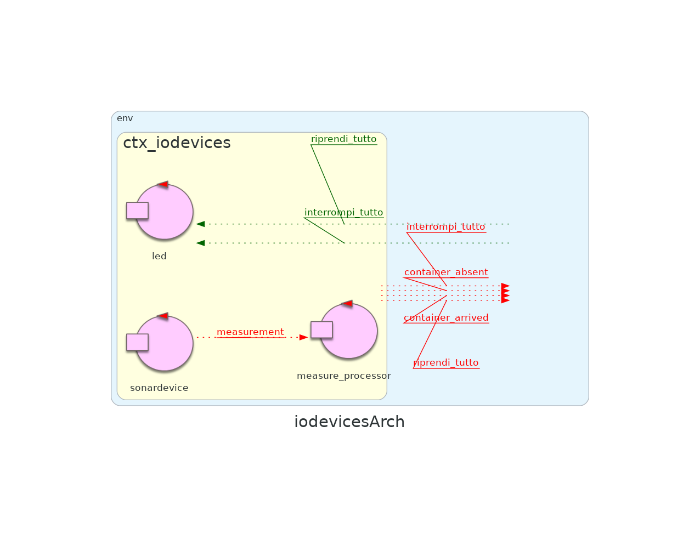

# Sprint 2


## Punto di partenza
Nello [sprint 1](https://github.com/ingegneria-sistemi-software-m/cargoservice/blob/master/sprint1) si sono implementati i componenti che definiscono il corebuisness del sistema: [_cargoservice_](https://github.com/ingegneria-sistemi-software-m/cargoservice/blob/master/sprint1/README.md#analisi-del-problema--cargoservice) e [_cargorobot_](https://github.com/ingegneria-sistemi-software-m/cargoservice/blob/master/sprint1/README.md#analisi-del-problema--cargorobot). 

Nel far questo si sono anche definite le interfaccie per i componenti _hold_ e _sonar_ da svilupparsi in questo sprint.

L'architettura del sistema risultante dallo sprint 1 è la seguente.


<div class="page-break"></div>


## Obiettivi
L'obiettivo dello sprint 2 sarà affrontare il sottoinsieme dei requisiti relativi ai componenti _sonar_ e _hold_, effettuando l'analisi del problema e la progettazione. Particolare importanza verrà data alle **interazioni** che questi componenti dovranno avere con il resto del sistema.


<!-- togli la roba tra parentesi  -->

I [requisiti](https://github.com/ingegneria-sistemi-software-m/cargoservice/tree/master/requirements) affrontati nello sprint 2 saranno i seguenti:
- implementare un sistema in grado di rilevare la presenza/assenza di un _container_ presso l'_IO-port_
    - ( 2. is able to detect (by means of the sonar sensor) the presence of the product container at the ioport )
- implementare un sistema in grado di rilevare e gestire malfunzionamenti del sonar
    - ( 5. interrupts any activity and turns on a led if the sonar sensor measures a distance D > DFREE for at least 3 secs (perhaps a sonar failure). The service continues its activities as soon as the sonar measures a distance D <= DFREE. ) 
- implementare un sistema in grado di tenere traccia dello stato del deposito. Questo include:
    - lo stato libero/occupato di ogni _slot_
    - il peso totale dei container caricati all'interno del deposito
    - (The request is rejected when:
            - the product-weight is evaluated too high, since the ship can carry a maximum load of MaxLoad>0  kg.
            - the hold is already full, i.e. the 4 slots are alrready occupied.)
- implementare un sistema in grado di condividere con la _web-gui_ (o a qualunque altro componente interessato) lo stato del deposito
    - (4. is able to show the current state of the hold, by mesans of a dynamically updated web-gui.)


## Analisi del problema | Sonar
L'attore _sonar_ è responsabile di effettuare **periodicamente** delle misurazioni di distanze allo scopo di rilevare la presenza dei container che arrivano all'_IO-port_.  

Il tipico ciclo di attività di _sonar_ è il seguente:
1. _sonar_ effettua una misurazione _m_ comandando il sensore fisico.

2. _sonar_ controlla in quale intervallo ricade _m_, le possibilità sono tre:
    - _0 < m < DFREE/2_
    - _DFREE/2 <= m <= DFREE_
    - _m > DFREE_

3. _sonar_ considera l'intervallo a cui appartiene _m_, e le misurazioni precedenti effettuate **negli ultimi 3 secondi**, per decidere cosa fare. Le possibilità sono quattro:
    - se le misurazioni effettuate sono state consistentemente _> 0_ e _< DFREE/2_, **significa che è presente un _container_** presso l'IO-port e _sonar_ notifica questo evento al resto del sistema.
    - se le misurazioni effettuate sono state consistentemente _>= DFREE/2_ e  _<= DFREE_, **significa che NON è presente un _container_** presso l'_IO-port_ e _sonar_ notifica questo evento al resto del sistema.  
    - se le misurazioni effettuate sono state consistentemente _> DFREE_, **significa che il sonar fisico è guasto** e _sonar_ (il componente software) **emette l'evento 'interrompi_tutto'** introdotto nello sprint 1 per interrompere le attività del resto del sistema.
    - se le misurazioni effettuate NON sono state consistenti, **non si può dedurre nulla**. _sonar_ non fa nulla.
    
4.  solo nel caso in cui la misurazione corrente _m_ abbia portato al passo precedente alla rilevazione di un guasto nel sonar fisico, **_sonar_ cambia di stato** e attende la prima misurazione _m' < DFREE_ prima di tornare ad uno stato di corretto funzionamento. All'arrivo della misurazione _m'_, _sonar_ fa ripartire il resto del sistema **emettendo l'evento 'riprendi_tutto'** introdotto nello sprint 1.


### Considerazioni
Il ciclo di attività dell'attore _sonar_ è divisibile in due fasi:
- fase di recupero della misurazione
- fase di processamento della misurazione

Risulta quindi possibile separare _sonar_ in **due attori distinti**, uno per fase. Questo porta ad avere come vantaggio il poter **produrre misurazioni fittizzie** sostituendo l'attore che recupera le misurazioni dal sonar fisico con un attore mock, oppure con una test unit, rendendo facilmente testabile la logica di processamento. 


### Problematiche
L'analisi fatta fino ad ora fa sorgere le seguenti domande.

#### Come fa _sonar_ a comandare il sonar fisico per ottenere le misurazioni?
Il caro committente ha fornito uno script python che fa proprio questo. Più nel dettaglio, lo script fornito comanda i **pin GPIO** di un **Raspberry PI** a cui il sonar fisico è collegato, ottenendo **una misurazione al secondo**.

```python
# File: sonar.py
import RPi.GPIO as GPIO
import time
import sys

GPIO.setmode(GPIO.BCM)
GPIO.setwarnings(False)
TRIG = 17
ECHO = 27

GPIO.setup(TRIG, GPIO.OUT)
GPIO.setup(ECHO, GPIO.IN)
GPIO.output(TRIG, False)   # TRIG parte LOW

print ('Waiting a few seconds for the sensor to settle')
time.sleep(2)

while True:
    GPIO.output(TRIG, True)    #invia impulso TRIG
    time.sleep(0.00001)
    GPIO.output(TRIG, False)

    pulse_start = time.time()
    #attendi che ECHO parta e memorizza tempo
    while GPIO.input(ECHO)==0:
        pulse_start = time.time()
    # register the last timestamp at which the receiver detects the signal.
    while GPIO.input(ECHO)==1:
        pulse_end = time.time()
    pulse_duration = pulse_end - pulse_start

    # velocità del suono ~= 340m/s 
    # distanza = v*t 
    # il tempo ottenuto misura un roundtrip -> distanza = v*t/2
    distance = pulse_duration * 17165
    distance = round(distance, 1)
    print ('Distance:', distance,'cm')
    sys.stdout.flush()
    time.sleep(1)
```


#### Come fa _sonar_ a capire se le misurazioni effettuate negli ultimi 3 secondi sono state consistenti?
È evidente che _sonar_ dovrà mantenere delle informazioni nel suo stato riguardanti le misurazioni precedenti. Più nel dettaglio, _sonar_ avrà bisogno di:
- una variabile che conta il numero di misurazioni consistenti effettuate.
- una variabile che indica in quale intervallo è ricaduta la misurazione precedente per capire quale intervallo considerare nel decidere se la misurazione corrente è consistente o meno.

Siccome le misurazioni vengono effettuate una volta al secondo, se il contatore raggiunge il valore 3 questo significa che le misurazioni sono state consistenti per almeno tre secondi e può quindi venire emesso l'evento corrispondente all'intervallo in cui le misurazioni sono ricadute.

Se una misurazione non è consistente, o se le misurazioni sono state consistenti per 3 secondi, il contatore viene resettato.


### Messaggi
_sonar_ emette tutti gli eventi definiti durante l'analisi di _cargorobot_ fatta nello sprint 1

```
Event container_arrived : container_arrived(X) 
Event container_absent  : container_absent(X)  
Event interrompi_tutto  : interrompi_tutto(X)  
Event riprendi_tutto    : riprendi_tutto(X)   
```

Oltre a questi, siccome si è deciso di separare _sonar_ in due attori distinti, si introduce un evento corrispondente ad una misurazione del sonar fisico. 

```
Event measurement 		: measurement(CM)
```


### Modello Sonar
L'analisi fatta fino ha portato al seguente modello.

```Java
QActor sonardevice context ctx_iodevices {
	[# 
		lateinit var reader : java.io.BufferedReader
	    lateinit var p : Process	
	    var Distance = 0
	#]	
	
	State s0 initial{
		println("$name | start") 
	 	[#
			p       = Runtime.getRuntime().exec("python sonar.py")
			reader  = java.io.BufferedReader( 
                        java.io.InputStreamReader(p.getInputStream())
                      )	
		#]		
	}
	Goto readSonarData
	
	State readSonarData{
		[# 
			var data = reader.readLine()
			
			if( data != null ){
				try{ 
					val vd = data.toFloat()
					val v  = vd.toInt()
					
					// filter the data maybe?
					if(v <= 100)
						Distance = v				
					else 
						Distance = 0
				}catch(e: Exception){
					CommUtils.outred("$name readSonarDataERROR: $e")
				}
			}
			
		#]	
		
		if [# Distance > 0 #] { 
		    println("$name | misurato $data cm") color yellow
			emitlocalstream measurement : measurement($Distance)			 
		}
	}
	Goto readSonarData
}


QActor measure_processor context ctx_iodevices {
	import "main.java.IntervalliMisurazioni"

	[# 
		val DFREE = 30 
        // uso degli enumerativi
		var CurrentIntervallo = IntervalliMisurazioni.PRIMA_MISURAZIONE
		var LastIntervallo = IntervalliMisurazioni.PRIMA_MISURAZIONE
		// conta quanti misurazioni di fila sono cadute nello stesso intervallo
		var CounterIntervallo = 1
		// flag che mi dice se sono in uno stato di malfunzionamento
		var Guasto = false
	#]	
	
	State s0 initial{
		println("$name | start") 
	 	subscribeTo sonardevice for measurement
	}
	Goto listen_for_measurement

	
	State listen_for_measurement {
		//aspetto
	}
	Transition t0
		whenEvent measurement -> process_measurement
		
		
	State process_measurement {
		onMsg(measurement : measurement(X)) {
			[# 
				val M = payloadArg(0).toInt()	
				CounterIntervallo++
			#]
			
			if [#  M < DFREE/2 #] { 
//				println("$name | container presente") color blue // DEBUG
				[# 
                    CurrentIntervallo =
                        IntervalliMisurazioni.CONTAINER_PRESENTE
                #]

				if [# Guasto #] {
					println("$name | sonar ripristinato") color green
					[# Guasto = false #]
					emit riprendi_tutto : riprendi_tutto(si)
				}
			}
			
			if [# M >= DFREE/2 && M <= DFREE #] { 
//				println("$name | container assente") color blue // DEBUG
				[# 
                    CurrentIntervallo =
                        IntervalliMisurazioni.CONTAINER_ASSENTE
                #]

				if [# Guasto #] {
					println("$name | sonar ripristinato") color green
					[# Guasto = false #]
					emit riprendi_tutto : riprendi_tutto(si)
				}
			}
			
			if [# M > DFREE #] { 
//				println("$name | guasto!!!") color blue // DEBUG
				[# CurrentIntervallo = IntervalliMisurazioni.GUASTO #]
			} 
			
			[#
				if(CurrentIntervallo==LastIntervallo &&
                   LastIntervallo!=IntervalliMisurazioni.PRIMA_MISURAZIONE)
                {
					// switch di Kotlin
					when(CurrentIntervallo) {
					    IntervalliMisurazioni.CONTAINER_PRESENTE -> {
					        if(CounterIntervallo == 3) {
					        	CommUtils.outmagenta("Container presente
                                                      consistentemente")
        	#]
								emit container_arrived :
                                     container_arrived(si)
			[#
					    		CounterIntervallo = 0
					    	}
					    }
					    IntervalliMisurazioni.CONTAINER_ASSENTE -> {
					    	if(CounterIntervallo == 3) {
					        	CommUtils.outmagenta("Container assente
                                                      consistentemente")
        	#]
								emit container_absent : 
                                     container_absent(si)
			[#
					    		CounterIntervallo = 0
					    	}
					    }
					    IntervalliMisurazioni.GUASTO -> {
					    	if(CounterIntervallo == 3) {
								CommUtils.outred("Guasto consistente")	
								Guasto = true
			#]
								emit interrompi_tutto : 
                                     interrompi_tutto(si)
			[#
								CounterIntervallo = 0			    		
					    	}
					    }
					    else -> {
					    	// ci vuole se no kotlin si lamenta in quanto
					    	// i casi sopra non sono esausitivi
					    }
					}
				} 
				else {
					// 1 in quanto questa è la prima misurazione 
                    // appartenente al suo intervallo
					CounterIntervallo = 1
				}
				
				LastIntervallo = CurrentIntervallo
			#]
		}
	}
	Goto listen_for_measurement
}
```


## Piano di test

### Sonar

#### Scenario 1: container presente per 3 secondi
```Java
@Test
public void testContainerArrived() throws Exception {
	// versione Java dei waitgroup di Go.
	// Serve a bloccare il main thread fino a quando 
	// i child thread non completano
	CountDownLatch latch = new CountDownLatch(1);
	// osservo il coap endpoint per ricevere gli eventi di reazione 
	// agli eventi che genero nel test
	CoapClient client = new CoapClient(SonarTest.CoapEndopoint);  
	CoapObserveRelation relation = client.observe(
		new CoapHandler() {
			@Override
			public void onLoad(CoapResponse response) {
				String content = response.getResponseText();
				CommUtils.outgreen("ActorObserver | value=" + content );
				
				assertTrue("TEST: container_arrived non ricevuto", 
							content.contains("container_arrived"));
				
				latch.countDown();
			}					
			@Override
			public void onError() {
				CommUtils.outred("OBSERVING FAILED");
				
				fail("errore nella osservazione del sonar");
				
				latch.countDown();
			}
		}
	);	
	
	// container presente per tre misurazioni
	IApplMessage measurement = 
		CommUtils.buildEvent("tester", "measurement", "measurement(10)");
	conn.forward(measurement);
	conn.forward(measurement);
	conn.forward(measurement);
	
	// Aspetto la risposta del coap endpoint.
	// latch.await() restituisce false se scade il timeout
	boolean arrived = latch.await(5, TimeUnit.SECONDS);
	relation.proactiveCancel();
	client.shutdown();
	// verifico anche che il timeout non sia scaduto
	assertTrue("onLoad non è stato invocato entro il timeout", arrived);
}
```

#### Scenario 2: container presente per 3 secondi e poi assente per 3 secondi
```Java
@Test
public void testContainerArrivedThenAbsent() throws Exception {
	// versione Java dei waitgroup di Go.
	// Serve a bloccare il main thread fino a quando 
	// i child thread non completano
	CountDownLatch latch = new CountDownLatch(2);
	// osservo il coap endpoint per ricevere gli eventi di reazione 
	// agli eventi che genero nel test
	CoapClient client = new CoapClient(SonarTest.CoapEndopoint);  
	CoapObserveRelation relation = client.observe(
		new CoapHandler() {
			int counter = 0;
			@Override
			public void onLoad(CoapResponse response) {
				String content = response.getResponseText();
				CommUtils.outgreen("ActorObserver | value=" + content );
				
				if(counter==1) {
					assertTrue("TEST: container_arrived non ricevuto",
						content.contains("container_arrived"));
				}
				else if(counter==2) {
					assertTrue("TEST: container_absent non ricevuto 
						dopo container_arrived",
						content.contains("container_absent"));
				}
				latch.countDown();
				
				counter++;
			}					
			@Override
			public void onError() {
				CommUtils.outred("OBSERVING FAILED");
				
				fail();
				
				latch.countDown();
				counter++;
			}
		}
	);	
	
	// container presente per tre misurazioni
	IApplMessage present_measurement = CommUtils.buildEvent("tester",
										"measurement", "measurement(10)");
	IApplMessage absent_measurement = CommUtils.buildEvent("tester",
										"measurement", "measurement(20)");
	
	conn.forward(absent_measurement);
	conn.forward(absent_measurement);
	conn.forward(absent_measurement);
	conn.forward(present_measurement);
	conn.forward(present_measurement);
	conn.forward(present_measurement);
	
	// Aspetto la risposta del coap endpoint.
	// latch.await() restituisce false se scade il timeout
	boolean arrived = latch.await(5, TimeUnit.SECONDS);
	relation.proactiveCancel();
	client.shutdown();
	// verifico anche che il timeout non sia scaduto
	assertTrue("onLoad non è stato invocato entro il timeout", arrived);
}
```


#### Scenario 3: rilevazione guasto e ripristino
```Java
@Test
public void testFaultySonarAndRecovery() throws Exception {
	// versione Java dei waitgroup di Go.
	// Serve a bloccare il main thread fino a quando 
	// i child thread non completano
	CountDownLatch latch = new CountDownLatch(2);
	
	// osservo il coap endpoint per ricevere gli eventi di reazione 
	// agli eventi che genero nel test
	CoapClient client = new CoapClient(SonarTest.CoapEndopoint);  
	CoapObserveRelation relation = client.observe(
		new CoapHandler() {
			int counter = 0;
			@Override
			public void onLoad(CoapResponse response) {
				String content = response.getResponseText();
				CommUtils.outgreen("ActorObserver | value=" + content );
				
				if(counter==0) {
					assertTrue("TEST: guasto non ricevuto",
						content.contains("guasto"));
				}
				else if(counter==1) {
					assertTrue("TEST: ripristino non ricevuto",
						content.contains("ripristinato"));
				}
				
				latch.countDown();
				
				counter++;
			}					
			@Override
			public void onError() {
				CommUtils.outred("OBSERVING FAILED");
				
				fail();
				
				latch.countDown();
				counter++;
			}
		}
	);	
	
	// container presente per tre misurazioni
	IApplMessage guasto_measurement = CommUtils.buildEvent("tester",
										"measurement", "measurement(31)");
	IApplMessage recovery_measurement = CommUtils.buildEvent("tester",
										"measurement", "measurement(20)");
	
	conn.forward(guasto_measurement);
	conn.forward(guasto_measurement);
	conn.forward(guasto_measurement);
	conn.forward(recovery_measurement);

	
	// Aspetto la risposta del coap endpoint.
	// latch.await() restituisce false se scade il timeout
	boolean arrived = latch.await(5, TimeUnit.SECONDS);
	relation.proactiveCancel();
	client.shutdown();
	// verifico anche che il timeout non sia scaduto
	assertTrue("onLoad non è stato invocato entro il timeout", arrived);
}
```


Successivamente, si è testato il sonar anche utilizzando i seguenti attori mock.

#### sonar_simul
```Java
QActor sonar_simul  context ctx_iodevices{
	State s0 initial{
	}
	Goto work

	State work{
		delay 1000 // attendo l'avvio di sonar_listener
		
		// misurazioni non consistenti
		emitlocalstream measurement      : measurement(30)
	    delay 1000
		emitlocalstream measurement      : measurement(15)
	    delay 1000
		emitlocalstream measurement      : measurement(10)
	    delay 1000
		emitlocalstream measurement      : measurement(0)
	    delay 1000
		emitlocalstream measurement      : measurement(40)
		
		// assente per 4 secondi
		emitlocalstream measurement      : measurement(20)
	    delay 1000
	    emitlocalstream measurement      : measurement(20)
	    delay 1000
	    emitlocalstream measurement      : measurement(20)
	    delay 1000
	    emitlocalstream measurement      : measurement(20)
	    delay 1000
	    
		// presente per 3 secondi
		emitlocalstream measurement      : measurement(10)
	    delay 1000
	    emitlocalstream measurement      : measurement(10)
	    delay 1000
	    emitlocalstream measurement      : measurement(10)
	    delay 1000
	    
	    // di nuovo presente per 3 secondi
	    emitlocalstream measurement      : measurement(10)
	    delay 1000
	    emitlocalstream measurement      : measurement(10)
	    delay 1000
	    emitlocalstream measurement      : measurement(10)
	    delay 1000
	    
	    // guasto per 5 secondi
	    emitlocalstream measurement      : measurement(31)
	    delay 1000
	    emitlocalstream measurement      : measurement(31)
	    delay 1000
	    emitlocalstream measurement      : measurement(31)
	    delay 1000
	    emitlocalstream measurement      : measurement(31)
	    delay 1000
	    emitlocalstream measurement      : measurement(31)
	    delay 1000
	    
	    // di nuovo presente per 2 secondi, assente per 3
	    emitlocalstream measurement      : measurement(10)
	    delay 1000
	    emitlocalstream measurement      : measurement(10)
	    delay 1000
	    emitlocalstream measurement      : measurement(20)
	    delay 1000
	    emitlocalstream measurement      : measurement(20)
	    delay 1000
	    emitlocalstream measurement      : measurement(20)
	    delay 1000
	}
}
```

#### sonar_listener
```Java
QActor sonar_listener context ctx_iodevices {
	State s0 initial{
		println("$name | start") 
	}
	Goto work
	
	
	State work {
		println("$name | working") color blue
		delay 1000
	}
	Transition t0
		whenEvent container_arrived -> container_arrived
		whenEvent container_absent -> container_absent
		whenEvent interrompi_tutto -> bloccato
		
		
	State container_arrived {
		println("$name | container_arrived") color green
		delay 1000
	} 
	Goto work
	
	
	State container_absent {
		println("$name | container_absent") color red
		delay 1000
	} 
	Goto work
	
		
	State bloccato {
		println("$name | bloccato!") color red
	}
	Transition t0
		whenEvent riprendi_tutto -> ripristinato
		
		
	State ripristinato {
		println("$name | ripristinato!") color green
	}
	Goto work
}
```


### Hold

## Analisi del problema | Hold
L'attore _hold_ è responsabile di effettuare dinamicamente la prenotazione degli slot di carico nella stiva, garantendo che la capacità massima della nave MaxLoad non venga superata.  

Il tipico ciclo di attività di _hold_ è il seguente:
1. _hold_ riceve da _cargoservice_ una richiesta di prenotazione di uno slot.
2. _hold_ ha il compito di tenere traccia della disponibilità degli slot liberi e del carico cumulativo, in base a ciò valuta la possibilità di effettuare l'intervento di carico. Le casistiche previste sono le seguenti:
	- Se il carico cumulativo (peso del nuovo container + carico attuale nel deposito) supera MaxLoad, non è possibile caricare il container. In tal caso _hold_ risponde a _cargoservice_ con **reserve_slot_fail**
	- Se il carico cumulativo non supera MaxLoad e non sono presenti slot liberi, anche in questo caso non è possibile caricare il container. In tal caso _hold_ risponde al _cargoservice_ con **reserve_slot_fail** 
	- Se Il carico cumulativo non supera MaxLoad e vi è almeno uno slot libero è possibile procedere con l'intervento di carico. La risposta al _cargoservice_ sarà **reserve_slot_success_**

### Considerazioni
Il ciclo di attività dell'attore _hold_ è divisibile in due fasi:
- fase di ricezione : Attesa passiva di messaggi (reserve_slot)
- fase di elaborazione : validazione delle richieste e aggiornamento dello stato interno

Si vuole sottolineare in questa parte che si è evinto dall'analisi dei requisiti che non è necessario implementare la casistica in cui gli slot di _hold_ si liberino.

In questa fase si è anche svolto una valutazione relativa al legame tra _hold_ e la componente _web-GUI_. Dall'analisi dei requisiti è risultato chiaro che questi due componenti devono interagire.In particolare, la web-gui deve recuperare lo stato mantenuto da _hold_ e ricevere da quest'ultimo aggiornamenti periodici. Per questo motivo, il comportamento dell'attore _hold_ è anche in grado di:
1. Rispondere a query riguardanti il suo stato
2. Emettere eventi di aggiornamento quando il suo stato subisce una modifica


### Messaggi
```
Request reserve_slot         : reserve_slot(WEIGHT) 			    	   "richiesta verso hold per prenotare uno slot. Contiene il peso del prodotto da caricare"
Reply   reserve_slot_success : reserve_slot_success(SLOT) for reserve_slot "se la richiesta è soddisfacibile, hold restituisce il nome/id dello slot prenotato"
Reply   reserve_slot_fail    : reserve_slot_fail(CAUSA) for reserve_slot   "fallisce se il peso supera MaxLoad oppure se non c'è uno slot libero"

Request get_hold_state		 : get_hold_state(X)						   "richiesta verso hold per conoscere lo stato iniziale del deposito.Contiene il peso attuale e lo stato degli slot"
Reply   hold_state			 : hold_state(JSonString)					   "risposta verso gui da parte di hold con le informazioni interne del deposito"

Event	hold_update			 : hold_update(JSonString)					   "evento che avvisa di un cambiamento nello stato interno di hold"
```


### Modello Hold

L'analisi fatta finora ha portato al seguente modello.

```Java
QActor hold context ctx_cargoservice{
	//Variabili di stato di Hold MaxLoad:Massimo peso caricabile sulla nave , Currentload: Peso del carico in un dato istante , slots: presenza o assenza di carico in un determinato slot
	[# 
		var MaxLoad = 500
		var currentLoad = 0
		val slots = hashMapOf(
			"slot1" to true, 
			"slot2" to true,
			"slot3" to true,
			"slot4" to true
		)
	
		fun getHoldStateJson(): String {
				val slotsJson = slots.map { (key, value) ->
				"\"$key\": \"${if (value) "free" else "occupied"}\""
			}.joinToString(", ")

			val rawJson = """{"currentLoad":$currentLoad,"slots":{$slotsJson}}"""

			// println("DEBUG raw JSON: $rawJson")

			return "'${rawJson.replace("'", "\\'")}'"    
		}
	#]
	
	
	State s0 initial {
		println("$name | STARTS - MaxLoad: $MaxLoad kg, Slots: $slots") color yellow
    
	}
	Goto wait_request
	
	  
	State wait_request{
		println("$name | waiting for reservation requests") color yellow
		
	}
	Transition t0
	   whenRequest get_hold_state -> serving_get_hold_state
	   whenRequest reserve_slot -> check_reservation
	  
	/*Verifico la presenza di slot liberi all'interno della stiva e che il MaxLoad della nave non venga superato */
	
	State check_reservation{
		onMsg(reserve_slot : reserve_slot(WEIGHT)){
			[#
				val weight = payloadArg(0).toInt()
				var FreeSlot: String ?= null
				var Cause = "" 

				if (currentLoad + weight > MaxLoad){
					Cause= "Exceeds MaxLoad"
				
				}else{
					FreeSlot = slots.entries.find {it.value}?.key // restituisce la chiave del  primo elemento della entry con valore true oppure restituisce null
					if (FreeSlot == null){
						Cause = "All slots are occupied"
					}
				}
			#]

			if [# FreeSlot != null #]{
				
				println("$name | reserving $FreeSlot for weight $weight") color green
				[# 
					slots[FreeSlot]=false
					currentLoad +=weight
					val JsonState = getHoldStateJson()
            		
				#]
				emit hold_update : hold_update($JsonState)
				replyTo reserve_slot with reserve_slot_success : reserve_slot_success($FreeSlot)

			}else{
				println("$name | reservation refused: $Cause") color red
				replyTo reserve_slot with reserve_slot_fail : reserve_slot_fail($Cause)

			}
		}
	}
	Goto wait_request
 

	//Stato dell'attore che si occupa di rispondere con lo stato iniziale del deposito
	State serving_get_hold_state{
		onMsg(get_hold_state : get_hold_state(X)){
			[#
				val JsonState = getHoldStateJson()
			#]
			println("$name | sending hold state") color yellow
			println("$name | DEBUG wrapped   = $JsonState") color red
			replyTo get_hold_state with hold_state : hold_state($JsonState)
		}
		
	}
	Goto wait_request
}
```
## Piano di test

### Hold

#### Scenario 1: Test prenotazione riuscita 

```text
@Test
    public void testReserveSlotSuccess() throws Exception {
        
        String requestStr = CommUtils.buildRequest("tester",
                "reserve_slot", "reserve_slot(100)", 
                "hold").toString();
        
        System.out.println("Richiesta Test 1: " + requestStr);
        
        String response = conn.request(requestStr);
        
        System.out.println("Risposta Test 1: " + response);
        
        assertTrue("TEST 1: prenotazione riuscita", 
                 response.contains("reserve_slot_success"));
    }
```
#### Scenario 2: Test intervento di carico rifiutato per superamento di MaxLoad


```text
@Test
    public void testReserveSlotFailExceedsMaxLoad() throws Exception {
        
        String requestStr = CommUtils.buildRequest("tester",
                "reserve_slot", "reserve_slot(600)", 
                "hold").toString();
        
        System.out.println("Richiesta Test 2: " + requestStr);
        
        String response = conn.request(requestStr);
        
        System.out.println("Risposta Test 2: " + response);
        
        assertTrue("TEST 2: Exceeds MaxLoad", 
                 response.contains("reserve_slot_fail") && 
                 response.contains("Exceeds MaxLoad"));
    }
```

#### Scenario 3: Prenotazione fallita data da nessuno slot libero


```text
 @Test
    public void testReserveSlotFailNoAvailableSlots() throws Exception {
       
        String state = conn.request(CommUtils.buildRequest("tester",
                "get_hold_state", "get_hold_state(X)", 
                "hold").toString());
        
        JSONObject slots = extractSlots(state);
        for (String slot : slots.keySet()) {
            if (slots.getString(slot).equals("free")) {
            	 
            	String requestStr = CommUtils.buildRequest("tester",
                         "reserve_slot", "reserve_slot(50)", 
                         "hold").toString();
                 
                 System.out.println("Richiesta Test 3: " + requestStr);
                 
                 String response = conn.request(requestStr);
                 
                 System.out.println("Risposta Test 3: " + response);
            }
        }  // Occupa gli slot liberi ai fini del test
        
        String response = conn.request(CommUtils.buildRequest("tester",
                "reserve_slot", "reserve_slot(50)", 
                "hold").toString());
        
        assertTrue("TEST 3: prenotazione dovrebbe fallire", 
                 response.contains("reserve_slot_fail"));
        assertTrue("TEST 3: motivo dovrebbe essere 'All slots are occupied'", 
                 response.contains("All slots are occupied"));
    }
```

#### Scenario 4: Richiesta dello stato corrente del deposito


```text
@Test
    public void testGetHoldState() throws Exception {
        String requestStr = CommUtils.buildRequest("tester",
                "get_hold_state", "get_hold_state(X)", 
                "hold").toString();
        
        System.out.println("Richiesta Test 4: " + requestStr);
        
        String response = conn.request(requestStr);
        
        System.out.println("Risposta Test 4: " + response);
        
        assertTrue("TEST 4: stato hold restituito correttamente", 
                 response.contains("hold_state") &&  
                 response.contains("currentLoad") && 
                 response.contains("slots"));
    }
```

#### Scenario 5: Verifica aggiornamento dello stato dopo una prenotazione


```text
@Test
    public void testStateUpdateAfterReservation() throws Exception {
       
    	
        String stateRequest = CommUtils.buildRequest("tester",
                "get_hold_state", "get_hold_state(X)", 
                "hold").toString();
        
        String initialState = conn.request(stateRequest);
        System.out.println("Test 5 --> Stato iniziale: " + initialState);
        
        int initialLoad = extractCurrentLoad(initialState);  //Carico attuale della nave
        
        int reservationWeight = 150;  	//Peso del container nuovo
        
        String reserveRequest = CommUtils.buildRequest("tester",
                "reserve_slot", "reserve_slot("+reservationWeight+")", 
                "hold").toString();
        
        String reserveResponse = conn.request(reserveRequest);
        System.out.println("Test 5 --> Risposta prenotazione: " + reserveResponse);
        
        String updatedState = conn.request(stateRequest);
        System.out.println("Test 5 --> Stato aggiornato: " + updatedState);
        
        int updatedLoad = extractCurrentLoad(updatedState);		//Peso dopo intervento di carico
        
        assertFalse("TEST 5: stato dovrebbe essere diverso dopo prenotazione", 
                initialState.equals(updatedState));
        assertEquals("TEST 5: currentLoad dovrebbe essere aumentato di " + reservationWeight, 
                 initialLoad + reservationWeight, updatedLoad);
    }
```


## Progettazione
Come per lo sprint 1 la modellazione tramite il DSL QAK ha prodotto dei modelli eseguibili. In questo caso, non c'è stato addirittura bisogno di una fase di progettazione. I componenti modellati sono già soddifacenti nella loro forma da modello eseguibile.   


## Sintesi Finale e Nuova Architettura

In questo sprint si sono implementati i componenti: [sonar](#analisi-del-problema--sonar) e [hold](#analisi-del-problema--hold). Grazie al primo, è diventato possibile rilevare la presenza/assenza dei container, grazie al secondo è diventato possibile gestire lo stato del deposito completando in questa maniera la logica del sistema.

Durante l'analisi del componente Hold si sono anche definiti i messaggi che quest'ultimo dovrà scambiarsi con la web-gui, componente che si implementerà nello sprint 3.

L'architettura del sistema risultante da questo sprint è suddivisibile in due macrocontesti.

#### Servizio principale


#### Dispositivi di I/O




### Tempo impiegato e suddivisione del lavoro
...