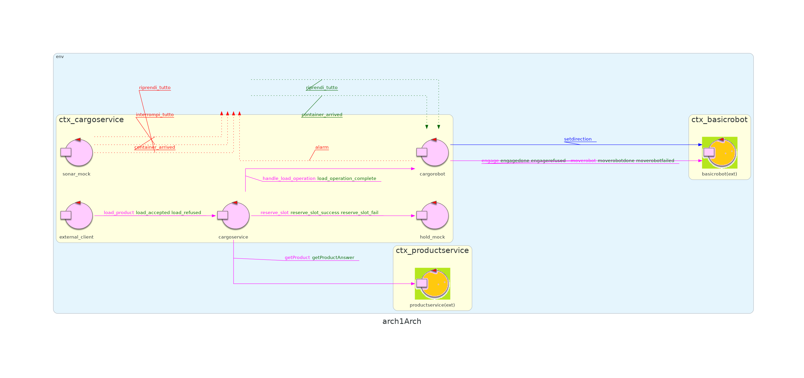

# Sprint 2


## Punto di partenza
Nello [sprint 1](https://github.com/ingegneria-sistemi-software-m/cargoservice/blob/master/sprint1) si sono implementati i componenti che definiscono il corebuisness del sistema: [_cargoservice_](https://github.com/ingegneria-sistemi-software-m/cargoservice/blob/master/sprint1/README.md#analisi-del-problema--cargoservice) e [_cargorobot_](https://github.com/ingegneria-sistemi-software-m/cargoservice/blob/master/sprint1/README.md#analisi-del-problema--cargorobot). 

Nel far questo si sono anche definite le interfaccie per i componenti _hold_ e _sonar_ da svilupparsi in questo sprint.

L'architettura del sistema risultante dallo sprint 1 è la seguente.



<div class="page-break"></div>


## Obiettivi
L'obiettivo dello sprint 2 sarà affrontare il sottoinsieme dei requisiti relativi ai componenti _sonar_ e _hold_, effettuando l'analisi del problema e la progettazione. Particolare importanza verrà data alle **interazioni** che questi componenti dovranno avere con il resto del sistema.


<!-- togli la roba tra parentesi  -->

I [requisiti](https://github.com/ingegneria-sistemi-software-m/cargoservice/tree/master/requirements) affrontati nello sprint 2 saranno i seguenti:
- implementare un sistema in grado di rilevare la presenza/assenza di un _container_ presso l'_IO-port_
    - ( 2. is able to detect (by means of the sonar sensor) the presence of the product container at the ioport )
- implementare un sistema in grado di rilevare e gestire malfunzionamenti del sonar
    - ( 5. interrupts any activity and turns on a led if the sonar sensor measures a distance D > DFREE for at least 3 secs (perhaps a sonar failure). The service continues its activities as soon as the sonar measures a distance D <= DFREE. ) 
- implementare un sistema in grado di tenere traccia dello stato del deposito. Questo include:
    - lo stato libero/occupato di ogni _slot_
    - il peso totale dei container caricati all'interno del deposito
    - (The request is rejected when:
            - the product-weight is evaluated too high, since the ship can carry a maximum load of MaxLoad>0  kg.
            - the hold is already full, i.e. the 4 slots are alrready occupied.)
- implementare un sistema in grado di condividere con la _web-gui_ (o a qualunque altro componente interessato) lo stato del deposito
    - (4. is able to show the current state of the hold, by mesans of a dynamically updated web-gui.)


## Analisi del problema | Sonar
L'attore _sonar_ è responsabile di effettuare **periodicamente** delle misurazioni di distanze allo scopo di rilevare la presenza dei container che arrivano all'_IO-port_.  

Il tipico ciclo di attività di _sonar_ è la seguente:
1. _sonar_ effettua una misurazione _m_ comandando il sensore fisico.

2. _sonar_ controlla in quale intervallo ricade _m_, le possibilità sono tre:
    - _0 < m < DFREE/2_
    - _DFREE/2 <= m <= DFREE_
    - _m > DFREE_

3. _sonar_ considera l'intervallo a cui appartiene _m_, e le misurazioni precedenti effettuate **negli ultimi 3 secondi**, per decidere cosa fare. Le possibilità sono quattro:
    - se le misurazioni effettuate sono state consistentemente _> 0_ e _< DFREE/2_, **significa che è presente un _container_** presso l'IO-port e _sonar_ notifica questo evento al resto del sistema.
    - se le misurazioni effettuate sono state consistentemente _>= DFREE/2_ e  _<= DFREE_, **significa che NON è presente un _container_** presso l'_IO-port_ e _sonar_ notifica questo evento al resto del sistema.  
    - se le misurazioni effettuate sono state consistentemente _> DFREE_, **significa che il sonar fisico è guasto** e _sonar_ (il componente software) **emette l'evento 'interrompi_tutto'** introdotto nello sprint 1 per interrompere le attività del resto del sistema.
    - se le misurazioni effettuate NON sono state consistenti, **non si può dedurre nulla**. _sonar_ non fa nulla.
    
4.  solo nel caso in cui la misurazione corrente _m_ abbia portato al passo precedente alla rilevazione di un guasto nel sonar fisico, **_sonar_ cambia di stato** e attende la prima misurazione _m' < DFREE_ prima di tornare ad uno stato di corretto funzionamento. All'arrivo della misurazione _m'_, _sonar_ fa ripartire il resto del sistema **emettendo l'evento 'riprendi_tutto'** introdotto nello sprint 1.


### Considerazioni
L'attore che effettua le misurazioni dal sonar fisico e l'attore che le processa possono essere due attori separati. Questa è una buona idea perchè ... 


### Problematiche
L'analisi fatta fino ad ora evidenzia fa sorgere delle domande.

#### Come fa _sonar_ a comandare il sonar fisico per ottenere le misurazioni?
Il caro committente ha fornito uno script python che fa proprio questo. Più nel dettaglio, lo script fornito comanda i **pin GPIO** di un **Raspberry PI** a cui il sonar fisico è collegato, ottenendo in questo modo **una misurazione al secondo**.

```python
# File: sonar.py
import RPi.GPIO as GPIO
import time
import sys

GPIO.setmode(GPIO.BCM)
GPIO.setwarnings(False)
TRIG = 17
ECHO = 27

GPIO.setup(TRIG, GPIO.OUT)
GPIO.setup(ECHO, GPIO.IN)
GPIO.output(TRIG, False)   # TRIG parte LOW

print ('Waiting a few seconds for the sensor to settle')
time.sleep(2)

while True:
    GPIO.output(TRIG, True)    #invia impulso TRIG
    time.sleep(0.00001)
    GPIO.output(TRIG, False)

    pulse_start = time.time()
    #attendi che ECHO parta e memorizza tempo
    while GPIO.input(ECHO)==0:
        pulse_start = time.time()
    # register the last timestamp at which the receiver detects the signal.
    while GPIO.input(ECHO)==1:
        pulse_end = time.time()
    pulse_duration = pulse_end - pulse_start

    # velocità del suono ~= 340m/s 
    # distanza = v*t 
    # il tempo ottenuto misura un roundtrip -> distanza = v*t/2
    distance = pulse_duration * 17165
    distance = round(distance, 1)
    print ('Distance:', distance,'cm')
    sys.stdout.flush()
    time.sleep(1)
```


#### Come fa _sonar_ a capire se le misurazioni effettuate negli ultimi 3 secondi sono state consistenti?
È evidente che _sonar_ dovrà mantenere delle informazioni nel suo stato riguardanti le misurazioni precedenti. Più nel dettaglio, _sonar_ avrà bisogno di:
- una variabile che conta il numero di misurazioni consistenti effettuate.
- una variabile che indica in quale intervallo è ricaduta la misurazione precedente per capire quale intervallo considerare nel decidere se la misurazione corrente è consistente o meno.

Siccome le misurazioni vengono effettuate una volta al secondo, se il contatore raggiunge il valore 3 questo significa che le misurazioni sono state consistenti per almeno tre secondi e può quindi venire emesso l'evento corrispondente all'intervallo in cui le misurazioni sono ricadute.

Se una misurazione non è consistente, o se le misurazioni sono state consistenti per 3 secondi, il contatore viene resettato.


### Modello Sonar


## Progettazione
forse ha senso spezzare il sonar in due attori in maniera da poter usare dei sonar simulator?