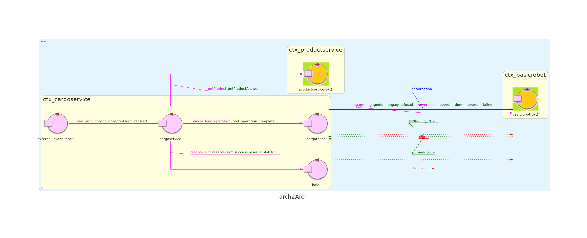
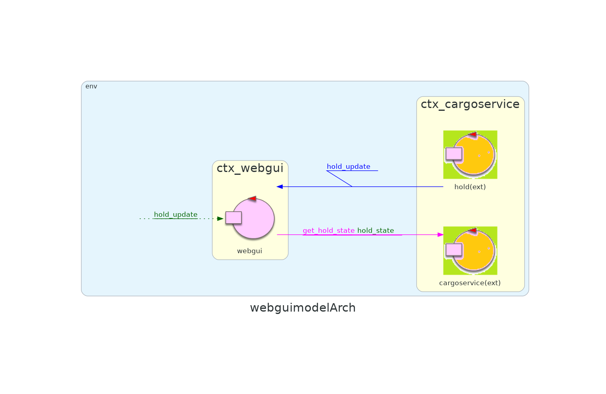

# Sprint 3

## Indice

- [Punto di Partenza](#punto-di-partenza)
- [Obiettivi](#obiettivi)
- [Led](#led)
- [WebGui](#webgui)
- [Deployment](#deployment)
- [Sintesi Finale e Nuova Architettura](#sintesi-finale-e-nuova-architettura)
- [Tempo Impiegato e Ripartizione del Lavoro](#tempo-impiegato-e-ripartizione-del-lavoro)

## Punto di Partenza

Nello sprint precedente si sono implementati i componenti: [sonar](https://github.com/ingegneria-sistemi-software-m/cargoservice/blob/master/sprint2/README.md#analisi-del-problema--sonar) e [hold](https://github.com/ingegneria-sistemi-software-m/cargoservice/blob/master/sprint2/README.md#analisi-del-problema--hold). Grazie al primo, è diventato possibile rilevare la presenza/assenza dei container, grazie al secondo è diventato possibile gestire lo stato del deposito completando in questa maniera la logica del sistema.

Durante l'analisi del componente Hold si sono anche definiti i messaggi che quest'ultimo dovrà scambiarsi con la web-gui, componente che si implementerà nello sprint 3.

L'architettura del sistema risultante da questo sprint è suddivisibile in due macrocontesti.


<div class="page-break"></div>

## Obiettivi

L'obiettivo dello sprint 3 sarà affrontare il sottoinsieme dei requisiti relativi ai componenti _webgui_ e _led_, effettuando l'analisi del problema e la progettazione. Particolare importanza verrà data alle **interazioni** che questi componenti dovranno avere con il resto del sistema.

I [requisiti](https://github.com/ingegneria-sistemi-software-m/cargoservice/tree/master/requirements) affrontati nello sprint 3 sono i seguenti:
- is able to show the current state of the hold, by means of a dynamically updated web-gui,
- interrupts any activity and turns on a led if the sonar sensor measures a distance D > DFREE for at least 3 secs (perhaps a sonar failure) and the service continues its activities as soon as the sonar measures a distance D <= DFREE.

## Led

### Analisi del Problema 

L'attore _led_ è responsabile di segnalare l'eventuale malfunzionamento del sonar. 

L'analisi del problema di _led_ è banale. Quando viene emesso un evento di guasto si accende il led fisico, e quando viene emesso l'evento di ripristino quest'ultimo viene spento.  

L'unica cosa non ovvia è come comandare l'accensione/spegnimento del led fisico. Similemente al caso del sonar, questo si può fare con uno script python che comanda i GPIO pin di un raspberry pi.

**Nota**: Data la semplicità del componente, non è stato previsto un piano di test.

#### Modello
```Java
QActor led context ctx_iodevices {
	State s0 initial{
	}
	Goto spento
	
	State spento {
		println("$name | sono spento") color red
		[# machineExec("python ledPython25Off.py") #]
	}
	Transition t0
		whenEvent interrompi_tutto -> acceso
	
	State acceso {
		println("$name | sono acceso") color green
		[# machineExec("python ledPython25On.py") #]
	}
	Transition t0
		whenEvent riprendi_tutto -> spento
}
```


## WebGui

### Analisi del Problema 

L'attore _webgui_ è responsabile di presentare lo stato degli slot e il peso complessivo dei container nel deposito. 

Si era già accennato nello [sprint2](https://github.com/ingegneria-sistemi-software-m/cargoservice/blob/master/sprint2/README.md#considerazioni-1) che lo stato del deposito mostrato dalla _webgui_ viene mantenuto dal componente _hold_, ma recuperato passando per _cargoservice_. Sempre nello stesso, si erano anche delineati dei messaggi che _webgui_ utilizzerà per recuperare lo stato del deposito e eventuali aggiornamenti di quest'ultimo(*get_hold_state* e  *hold_update*).   

Il tipico ciclo di attività di _webgui_ è il seguente:
1. All'avvio, _webgui_ richiede lo stato corrente del deposito inviando una richiesta a _cargoservice_ e comincia ad **osservare** il componente _hold_ come risorsa CoAP (vedi [progettazione sprint2](https://github.com/ingegneria-sistemi-software-m/cargoservice/blob/master/sprint2/README.md#entità-esterne))
2. Ricevuta la risposta da _cargoservice_, _webgui_ può cominciare a mostrare lo stato del deposito 
3. Ogni volta che si verifica una modifica al deposito, con conseguente aggiornamento della risorsa CoAP _hold_, _webgui_ mostra i cambiamenti.

#### Modello
```Java
QActor webgui context ctx_webgui {
    [#
        var CurrentState = "{}"

        fun stateUpdate(json: String){
            CurrentState = json
            println("Hold State: $CurrentState") 
        }
    #]

    State init initial {
        delay 1000
        println("$name | START")
        
        // webgui osserva hold per aggiornamenti
        observeResource hold msgid hold_update
        
        println("$name | getting hold state for the first time")
		// chiedo a cargoservice che girerà ad hold
        request cargoservice -m get_hold_state : get_hold_state(si)
    }
    Transition t0
        whenReply hold_state -> handleHoldState


    State handleHoldState {
    	println("$name | processing reply")
    	
    	onMsg( hold_state : hold_state(JSON) ) {
	        [#
	            val receivedState = payloadArg(0)
	            println("$name | initial hold state: $receivedState") 
	            stateUpdate(receivedState)
	        #]
        }
    }
    Goto listening


    State listening {
        println("$name | waiting for hold updates")
    }
    Transition t1
    	whenEvent hold_update -> update_webgui
        // Con CoAP l'evento si traduce in un dispatch agli observer 
        whenMsg hold_update -> update_webgui  


   State update_webgui {
   		println("$name | update $currentMsg") color red 
   		
		[#
            var UpdateJson = payloadArg(0)
            println("$name | hold update received: $UpdateJson") 
            stateUpdate(UpdateJson)
        #]
    }
    Goto listening
}
```

### Piano di Test

#### Scenario 1: Invio evento hold_update e verifica ricezione con CoAP
```Java
@Test
public void testHoldUpdateEventReceptionWithCoap() throws Exception {
    
    // Serve a bloccare il main thread fino a quando i child thread non completano
    CountDownLatch latch = new CountDownLatch(1);
    
    CoapClient client = new CoapClient(COAP_ENDPOINT);

    CoapObserveRelation relation = client.observe(new CoapHandler() {
        @Override
        public void onLoad(CoapResponse response) {
            String content = response.getResponseText();
            System.out.println("CoAP notification received: " + response);

            // Controllo se il messaggio contiene il carico aggiornato
            if (content.contains("\"currentLoad\":100" )
                && content.contains("\"slot1\":occupied"))
            {

                latch.countDown();
            }
        }

        @Override
        public void onError() {
            System.err.println("CoAP observing failed");
            fail("Errore durante l'osservazione CoAP");
            latch.countDown();
        }
    });

    // Costruisco e invio l'evento hold_update
    String updateJson = "{\"currentLoad\":100, \"slots\": {\"slot1\":\"occupied\", \"slot2\":\"free\", \"slot3\":\"free\", \"slot4\":\"free\"}}";
    String event = CommUtils.buildEvent("tester", "hold_update", "hold_update('" + updateJson.replace("\"", "\\\"") + "')").toString();

    System.out.println("Invio evento hold_update: " + event);
    conn.forward(event);

    //Rimane bloccato qui finchè non viene eseguito latch.countDown()
    latch.await();

    // Pulizia
    relation.proactiveCancel();
    client.shutdown();
    
    assertTrue("Evento hold_update correttamente ricevuto via CoAP", true);
}
```


### Progettazione

L'applicazione _webgui_ è un sistema sviluppato utilizzando SpringBoot un framework Java-based scelto per la sua semplicità di configurazione, l'integrazione nativa con pattern MVC e l'uso di annotazioni per la gestione semplificata dei Controller.

La _webgui_ è stata progettata col fine di monitorare lo stato della stiva (_hold_) e visualizzarne i cambiamenti in tempo reale attraverso un'interfaccia web. La _Webgui_ è un sistema passivo, capace di ricevere e inoltrare aggiornamenti all'interfaccia web.

Ogni componente della _webgui_ è responsabile di una specifica funzionalità, come voluto dal principio di singola responsabilità. Ritroviamo tre principali componenti quali:

- HoldStateService: Accesso TCP e interrogazione su richiesta dello stato.
- WSHandler: Gestione WebSocket.
- CoapToWS: Client CoAP e gestione degli aggiornamenti.

#### Componenti e responsabilità

WSHandler:

Il WSHandler è il componente di comunicazione WebSocket occupandosi della gestione delle connessioni con i client browser. Le sessioni attive sono mantenute in memoria, e ogni aggiornamento ricevuto dal sistema viene immediatamente inoltrato ai client tramite broadcast. Le sue funzioni principali sono quelle di:
- Gestire tutte le sessioni client WebSocket connesse
- Fornire un metodo **sendToAll**, che trasmette il messaggio JSON ricevuto da **HoldStateService** o **CoapToWS** a tutti i client attivi.

WebSocketConfig:

Implementa WebSocketConfigurer per registrare l'handler WebSocket su un endpoint specifico (/status-updates).

CoapToWS:

Questa componente si comporta come un osservatore CoAP. Alla sua inizializzazione si sottoscrive come osservatore dello stato interno di _hold_ accessibile tramite un path specifico: 

```
coap://localhost:8000/ctx_cargoservice/hold
```
Ogni volta che lo stato di _hold_ si aggiorna, il CoAP client riceve l'aggiornamento corrispondente tramite un messaggio. Il messaggio viene elaborato estraendo le informazioni e costruendo un nuovo JSON che viene successivamente inviato via WebSocket ai client, tramite WSHandler.


HoldStateService:

Questa componente ha il compito di inviare una richiesta TCP all'attore esterno _hold_ per ottenere il suo stato. Il flusso è il seguente:
1. L'utente accede al sito web
2. L'interfaccia invia una richiesta HTTP GET all'endopoint **/holdstate** fornito dal backend SpringBoot.
3. Il controller delega a HoldStateService, che  aprendo una connessione TCP verso l'attore _hold, inoltra una richiesta **get_hold_state(X)**.
4. I dati ricevuti vengono convertiti in un oggetto JSON comprensibile dal browser.
5. Il JSON successivamente viene inviato via WebSocker al browser.


CallerService:

Questo componente rappresenta un altro punto d'ingresso per le richieste HTTP provenienti dal browser. Espone l'endpoint /callet?pid=XX, che invia al sistema principale una richiesta di tipo **load_product(pid)**

Interfaccia web:

La pagina principale di monitoraggio è una semplice interfaccia HTML+CSS+JS responsiva.Include:
- Visualizzazione del carico totale della nave
- Stato dei 4 slot del deposito
- Connessione automatica all' endpoint /status-updates 
- Riconessione automatica in caso di disconnessione
- Data e ora dell'ultimo aggiornamento ricevuto

Al caricamento della pagina viene eseguita anche una chiamata fetch a /holdstate per ottenere lo stato iniziale.

E' stata predisposta anche una seconda pagina HTML che consente all'utente di inviare un **Product ID** al sistema. Il risultato viene mostrato nella stessa pagina all'interno di un box. La risposta può essere:
- Conferma del caricamento
- Errore


## Deployment
I modelli QAK sviluppati in questo sprint sono recuperabile alla [seguente repository github](https://github.com/ingegneria-sistemi-software-m/cargoservice/tree/master/sprint3), dentro alle cartella "system3/" e "iodevices/".

L'intero sistema è stato **containerizzato**, il deployment risulta quindi immediato. Si hanno due possibilità: una se si ha a disposizione un raspberry pi per il sonar, alternativamente si è anche predisposta una versione del sistema con un simulatore del sonar.

### Cargoservice con sonar-simulator

1. eseguire ```docker compose -f arch3-local.yaml up``` per lanciare l'intero sistema
2. aggiungere qualche prodotto al db mongo appena avviato, eseguendo con node lo script [setupmongo.js](https://github.com/ingegneria-sistemi-software-m/cargoservice/blob/master/setup_mongo.js)
3. aprire il browser e digitare ```localhost:8090``` per visualizzare l'ambiente virtuale WEnv e il robot che effettua i suoi interventi di carico
4. aprire un'altra scheda del browser e digitare ```localhost:8080``` per visualizzare la GUI che mostra lo stato del deposito
5. aprire una terza e ultima finestra e digitare ```localhost:8080/caller.html``` per visualizzare una GUI con cui mandare le richieste di carico


### Cargoservice con sonar su raspberry pi
1. creare una distribuzione del progetto [/iodevices](https://github.com/ingegneria-sistemi-software-m/cargoservice/tree/master/sprint3/iodevices) eseguendo ```./gradlew distTar```
2. copiare la distribuzione ottenuta dentro al raspberry, estrarre i contenuti, ed avviare i componenti sonar eseguendo il binario dentro alla cartella /bin
3. eseguire ```docker compose -f arch3-rpi.yaml up``` per lanciare l'intero sistema (apparte il sonar e il led)
4. aggiungere qualche prodotto al db mongo appena avviato, eseguendo con node lo script [setupmongo.js](https://github.com/ingegneria-sistemi-software-m/cargoservice/blob/master/setup_mongo.js)
5. aprire il browser e digitare ```localhost:8090``` per visualizzare l'ambiente virtuale WEnv e il robot che effettua i suoi interventi di carico
6. aprire un'altra scheda del browser e digitare ```localhost:8080``` per visualizzare la GUI che mostra lo stato del deposito
7. aprire una terza e ultima finestra e digitare ```localhost:8080/caller.html``` per visualizzare una GUI con cui mandare le richieste di carico


## Sintesi Finale e Nuova Architettura

In questo sprint si sono implementati i componenti: [led](#analisi-del-problema--led) e [webgui](#analisi-del-problema--webgui). Grazie al primo, è diventato possibile segnalare la presenza di un malfunzionamento del sonar, grazie al secondo è diventato possibile visualizzare lo stato degli slot e il peso complessivo dei container nel deposito.

L'architettura del sistema risultante da questo sprint è definisce il nuovo macrocontesto della webgui.

### Servizio principale



### Dispositivi di I/O


### WebGui

 

## Tempo Impiegato e Ripartizione del Lavoro

## Tempo Impiegato

Lo sprint ha richiesto poche ore in più del previsto.
Avevamo previsto di procedere al ritmo di uno sprint alla settimana, e così è stato.

### Ripartizione del Lavoro

Non c'è nessuna differenza tra la ripartizione del lavoro in questo sprint e la ripartizione del lavoro nel precedente.

Come previsto, tutti i membri del gruppo hanno partecipato attivamente a tutte le fasi dello sviluppo. Questa modalità organizzativa si è rivelata particolarmente soddisfacente, poiché le principali difficoltà riscontrate durante gli sprint hanno riguardato soprattutto la fase di analisi e progettazione, più che quella di implementazione.  

In questo contesto, si è dimostrato molto efficace affrontare le problematiche attraverso sessioni di brainstorming collettivo. È infatti raro che un singolo componente riesca a cogliere da solo tutte le sfaccettature di una tematica complessa, mentre il confronto tra punti di vista diversi porta spesso alla sintesi di soluzioni condivise, in grado di soddisfare l’intero team.  

Particolarmente utile si è rivelata la necessità di esporre e argomentare le proprie idee fin dalle prime fasi di analisi: il confronto verbale permette di individuare tempestivamente eventuali errori o fraintendimenti, e assicura che il gruppo proceda in maniera coerente, evitando che si consolidino interpretazioni discordanti che potrebbero compromettere il lavoro futuro.