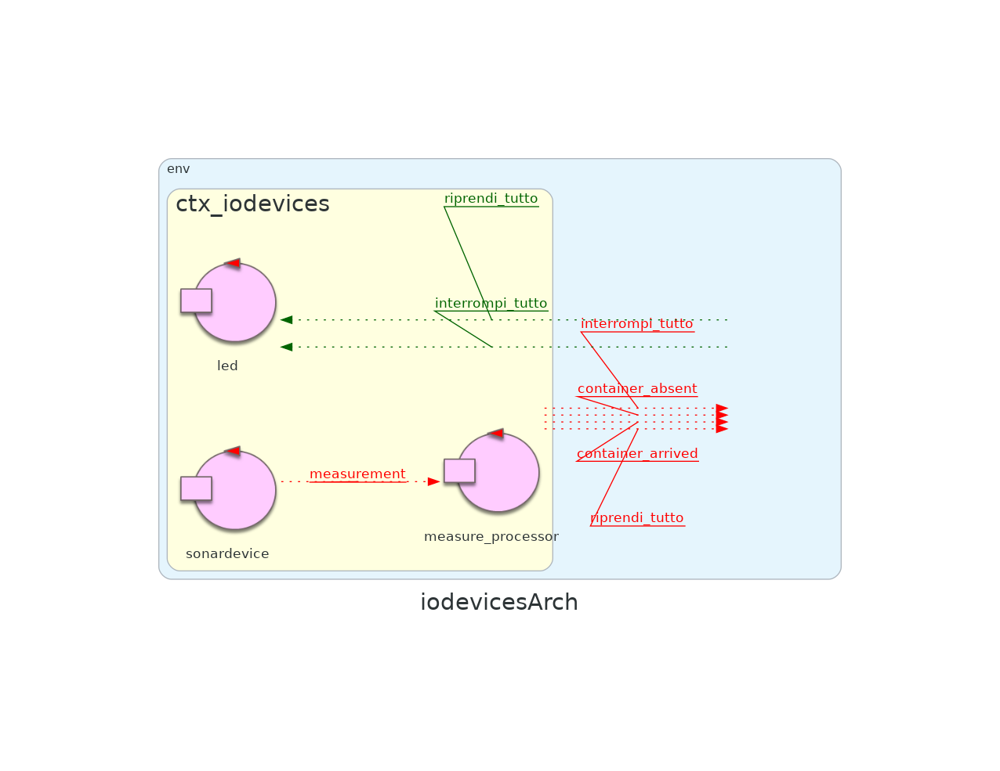

# Sprint 3

## Indice

- [Punto di Partenza](#punto-di-partenza)
- [Obiettivi](#obiettivi)
- [Led](#led)
- [WebGui](#webgui)
- [Deployment](#deployment)
- [Sintesi Finale e Nuova Architettura](#sintesi-finale-e-nuova-architettura)
- [Tempo Impiegato e Ripartizione del Lavoro](#tempo-impiegato-e-ripartizione-del-lavoro)

## Punto di Partenza

Nello sprint precedente si sono implementati i componenti: [sonar](https://github.com/ingegneria-sistemi-software-m/cargoservice/blob/master/sprint2/README.md#analisi-del-problema--sonar) e [hold](https://github.com/ingegneria-sistemi-software-m/cargoservice/blob/master/sprint2/README.md#analisi-del-problema--hold). Grazie al primo, è diventato possibile rilevare la presenza/assenza dei container, grazie al secondo è diventato possibile gestire lo stato del deposito completando in questa maniera la logica del sistema.

Durante l'analisi del componente Hold si sono anche definiti i messaggi che quest'ultimo dovrà scambiarsi con la web-gui, componente che si implementerà nello sprint 3.

L'architettura del sistema risultante da questo sprint è suddivisibile in due macrocontesti.

## Obiettivi

L'obiettivo dello sprint 3 sarà affrontare il sottoinsieme dei requisiti relativi ai componenti _webgui_ e _led_, effettuando l'analisi del problema e la progettazione. Particolare importanza verrà data alle **interazioni** che questi componenti dovranno avere con il resto del sistema.

Il [requisito](https://github.com/ingegneria-sistemi-software-m/cargoservice/tree/master/requirements) principale affrontato nello sprint 3 è il seguente:
- is able to show the current state of the hold, by means of a dynamically updated web-gui.

## Led

### Analisi del Problema 

#### Modello

## WebGui

### Analisi del Problema 

#### Modello

#### Piano di Test

### Progettazione

## Deployment

## Sintesi Finale e Nuova Architettura

In questo sprint si sono implementati i componenti: [led](#analisi-del-problema--led) e [webgui](#analisi-del-problema--webgui). Grazie al primo, è diventato possibile segnalare la presenza di un malfunzionamento del sonar, grazie al secondo è diventato possibile visualizzare lo stato degli slot e il peso complessivo dei container nel deposito.

L'architettura del sistema risultante da questo sprint è definisce il nuovo macrocontesto della webgui.

### Servizio principale

### Dispositivi di I/O

### WebGui

 //immagine ancora da fare sulla webgui

## Tempo Impiegato e Ripartizione del Lavoro

## Tempo Impiegato

Lo sprint ha richiesto poche ore in più del previsto.
Avevamo previsto di procedere al ritmo di uno sprint alla settimana, e così è stato.

### Ripartizione del Lavoro

Non c'è nessuna differenza tra la ripartizione del lavoro in questo sprint e la ripartizione del lavoro nel precedente.

Come previsto, tutti i membri del gruppo hanno partecipato attivamente a tutte le fasi dello sviluppo. Questa modalità organizzativa si è rivelata particolarmente soddisfacente, poiché le principali difficoltà riscontrate durante gli sprint hanno riguardato soprattutto la fase di analisi e progettazione, più che quella di implementazione.  

In questo contesto, si è dimostrato molto efficace affrontare le problematiche attraverso sessioni di brainstorming collettivo. È infatti raro che un singolo componente riesca a cogliere da solo tutte le sfaccettature di una tematica complessa, mentre il confronto tra punti di vista diversi porta spesso alla sintesi di soluzioni condivise, in grado di soddisfare l’intero team.  

Particolarmente utile si è rivelata la necessità di esporre e argomentare le proprie idee fin dalle prime fasi di analisi: il confronto verbale permette di individuare tempestivamente eventuali errori o fraintendimenti, e assicura che il gruppo proceda in maniera coerente, evitando che si consolidino interpretazioni discordanti che potrebbero compromettere il lavoro futuro.